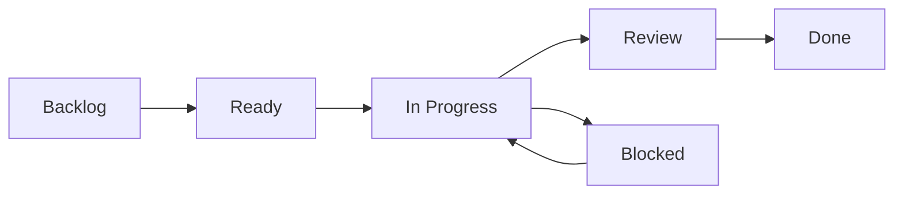

# 📋 Project Management Guide for StackWizard

## 🚀 Quick Start

### 1. Initial Setup (Run Once)
```bash
# Run the setup script to create labels and milestones
./scripts/setup-project-management.sh
```

### 2. Daily Sprint Board
```bash
# Interactive sprint board CLI
./scripts/sprint-board.sh
```

## 📱 Using the System

### Creating Items

#### Create User Story
```bash
gh issue create --template user-story.md
# OR use the sprint board: ./scripts/sprint-board.sh → Option 5
```

#### Create Task
```bash
gh issue create --template task.md
# OR use the sprint board: ./scripts/sprint-board.sh → Option 6
```

#### Report Bug
```bash
gh issue create --template bug_report.md
# OR use the sprint board: ./scripts/sprint-board.sh → Option 7
```

### Managing Work

#### View Sprint Board
```bash
# See all tasks by status
gh issue list --label "status: in-progress"
gh issue list --label "status: ready"
gh issue list --label "status: blocked"

# OR use sprint board: ./scripts/sprint-board.sh → Option 1
```

#### Start Working on Task
```bash
# Move task to in-progress and assign to yourself
gh issue edit 123 \
  --add-label "status: in-progress" \
  --remove-label "status: ready" \
  --add-assignee "@me"

# OR use sprint board: ./scripts/sprint-board.sh → Option 9
```

#### Complete Task
```bash
# Mark as done and close
gh issue edit 123 --add-label "status: done"
gh issue close 123

# OR use sprint board: ./scripts/sprint-board.sh → Option 10
```

## 📊 Workflow



### Status Labels
- `status: backlog` - New items, not refined
- `status: ready` - Ready to work on
- `status: in-progress` - Currently being worked on
- `status: review` - In code review
- `status: blocked` - Blocked by dependency
- `status: done` - Completed

### Priority Labels
- `priority: critical` - Drop everything
- `priority: high` - Next sprint
- `priority: medium` - Soon
- `priority: low` - Someday

### Story Points
- `sp: 1` - Few hours
- `sp: 2` - Half day
- `sp: 3` - Full day
- `sp: 5` - 2-3 days
- `sp: 8` - Week
- `sp: 13` - More than a week

## 🎯 Common Commands

### Quick Filters
```bash
# My tasks
gh issue list --assignee "@me"

# High priority items
gh issue list --label "priority: high"

# Blocked tasks
gh issue list --label "status: blocked"

# User stories for next release
gh issue list --label "user-story" --milestone "v1.1.0"

# Bugs
gh issue list --label "bug"

# Good first issues
gh issue list --label "good-first-issue"
```

### Bulk Operations
```bash
# Add label to multiple issues
gh issue edit 1 2 3 --add-label "status: ready"

# Assign milestone to issues
gh issue edit 10 11 12 --milestone "v1.1.0"

# Close multiple completed issues
gh issue close 20 21 22
```

### Search
```bash
# Search in titles and body
gh issue list --search "database"

# Find mentions
gh issue list --search "mentions:@me"

# Recent issues
gh issue list --search "created:>2025-08-20"
```

## 📈 Reports

### Sprint Velocity
```bash
# Count story points completed
gh issue list --label "status: done" --label "sp: 5" --json number | jq length

# OR use sprint board: ./scripts/sprint-board.sh → Option 13
```

### Burndown
```bash
# Remaining vs completed
echo "Remaining: $(gh issue list --label 'status: in-progress' --json number | jq length)"
echo "Completed: $(gh issue list --label 'status: done' --json number | jq length)"

# OR use sprint board: ./scripts/sprint-board.sh → Option 14
```

## 🔗 Web Interface

### GitHub Issues
https://github.com/rafeekpro/stackwizard/issues

### Filters (Bookmarks)
- [User Stories](https://github.com/rafeekpro/stackwizard/issues?q=is%3Aopen+label%3Auser-story)
- [My Tasks](https://github.com/rafeekpro/stackwizard/issues?q=is%3Aopen+assignee%3A%40me)
- [In Progress](https://github.com/rafeekpro/stackwizard/issues?q=is%3Aopen+label%3A%22status%3A+in-progress%22)
- [Blocked](https://github.com/rafeekpro/stackwizard/issues?q=is%3Aopen+label%3A%22status%3A+blocked%22)
- [High Priority](https://github.com/rafeekpro/stackwizard/issues?q=is%3Aopen+label%3A%22priority%3A+high%22)

## 🏃 Sprint Ceremonies

### Sprint Planning
1. Review backlog
2. Estimate story points
3. Move to "Ready" status
4. Assign sprint milestone

### Daily Standup
```bash
# What I did yesterday
gh issue list --assignee "@me" --label "status: done" --search "updated:>1 day"

# What I'm doing today
gh issue list --assignee "@me" --label "status: in-progress"

# Blockers
gh issue list --assignee "@me" --label "status: blocked"
```

### Sprint Review
```bash
# Show completed items
gh issue list --state closed --milestone "Sprint 1"
```

### Sprint Retrospective
- Update SPRINTS.md with retrospective notes
- Create improvement tasks

## 🔧 Customization

### Add Custom Labels
```bash
gh label create "tech-debt" -c "FF6B6B" -d "Technical debt"
```

### Create Saved Searches (Aliases)
```bash
# Add to ~/.bashrc or ~/.zshrc
alias my-tasks='gh issue list --assignee "@me"'
alias sprint-board='gh issue list --label "status: in-progress"'
alias blocked='gh issue list --label "status: blocked"'
```

### GitHub CLI Extensions
```bash
# Install gh-sprint extension (if available)
gh extension install mislav/gh-sprint

# Use it
gh sprint status
```

## 💡 Tips

1. **Keep issues small** - If it's more than 8 story points, break it down
2. **Update daily** - Move cards as you progress
3. **Add comments** - Document decisions and blockers
4. **Link PRs** - Use "Fixes #123" in PR descriptions
5. **Use milestones** - Group issues by release
6. **Regular grooming** - Review backlog weekly

## 🆘 Troubleshooting

### Can't create labels
```bash
# Check authentication
gh auth status

# Re-authenticate with proper scopes
gh auth refresh -s repo
```

### Can't see issues
```bash
# Check repository
gh repo set-default rafeekpro/stackwizard
```

### Sprint board not working
```bash
# Make sure script is executable
chmod +x scripts/sprint-board.sh

# Check gh CLI is installed
gh --version
```

## 📚 Resources

- [GitHub Issues Documentation](https://docs.github.com/en/issues)
- [GitHub CLI Manual](https://cli.github.com/manual/)
- [Agile Best Practices](https://www.atlassian.com/agile/scrum)
- [Our Roadmap](./ROADMAP.md)
- [Sprint Tracking](./SPRINTS.md)

---

*Need help? Create an issue with the `help wanted` label!*