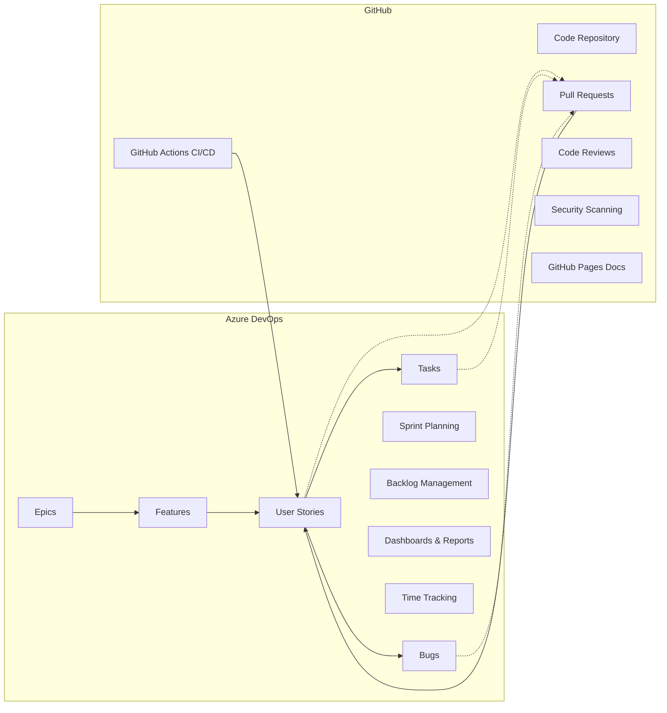

# 🔄 Azure DevOps + GitHub Integration Guide

## 📋 Architektura Hybrydowa



## 🚀 Krok 1: Połączenie Azure DevOps z GitHub

### A. W Azure DevOps:

1. **Utwórz projekt:**
```bash
az devops project create --name "StackWizard" --org "https://dev.azure.com/yourorg"
```

2. **Idź do Project Settings → Service Connections**
3. **New Service Connection → GitHub**
4. **Authorize z OAuth lub Personal Access Token**

### B. W GitHub:

1. **Settings → Integrations → Azure Boards**
2. **Authenticate to Azure DevOps**
3. **Select your Azure DevOps organization**

## 🔗 Krok 2: Automatyczne Linkowanie

### Magiczne słowa kluczowe w GitHub:

```markdown
# W PR description lub commit message:

"Fixes AB#123"        # Zamyka Azure Boards work item #123
"Implements AB#456"   # Linkuje do work item #456
"Related to AB#789"   # Dodaje link bez zmiany statusu

# Przykład commit:
git commit -m "feat: Add OAuth2 login

Implements AB#234 - User Story for Google authentication
Fixes AB#567 - Bug with token refresh"
```

### Co się dzieje automatycznie:

1. **PR utworzony** → Work Item zmienia status na "In Progress"
2. **PR merged** → Work Item zmienia status na "Done"
3. **Build failed** → Komentarz w Work Item
4. **Deploy success** → Update w Work Item

## 📊 Krok 3: Konfiguracja Azure Boards

### Utwórz proces Agile:

```bash
# Instalacja Azure CLI extension
az extension add --name azure-devops

# Konfiguracja
az devops configure --defaults organization=https://dev.azure.com/yourorg project=StackWizard

# Tworzenie Area Paths
az boards area project create --name "Frontend"
az boards area project create --name "Backend"
az boards area project create --name "DevOps"

# Tworzenie Iterations (Sprints)
az boards iteration project create --name "Sprint 1" --start-date 2025-08-26 --finish-date 2025-09-08
az boards iteration project create --name "Sprint 2" --start-date 2025-09-09 --finish-date 2025-09-22
```

### Przykładowe Work Items:

```bash
# Epic
az boards work-item create \
  --title "Database Flexibility" \
  --type "Epic" \
  --area "StackWizard" \
  --iteration "StackWizard" \
  --fields "Description=Support for multiple database systems"

# User Story
az boards work-item create \
  --title "As a developer, I want to choose PostgreSQL or MySQL" \
  --type "User Story" \
  --area "StackWizard\Backend" \
  --iteration "StackWizard\Sprint 1" \
  --fields "Description=Allow database selection during project generation" \
           "AcceptanceCriteria=- CLI prompts for database\n- Docker compose configured\n- Migrations work" \
           "StoryPoints=8"

# Task linked to User Story
az boards work-item create \
  --title "Add database selection to CLI prompts" \
  --type "Task" \
  --parent 123 \
  --assigned-to "developer@email.com" \
  --fields "OriginalEstimate=4" \
           "Description=Update inquirer prompts in src/index.js"
```

## 🤖 Krok 4: GitHub Actions Integration

### `.github/workflows/azure-boards-sync.yml`:

```yaml
name: Azure Boards Sync

on:
  pull_request:
    types: [opened, closed]
  issues:
    types: [opened, closed, reopened]

jobs:
  sync-to-azure:
    runs-on: ubuntu-latest
    steps:
      - name: Azure Login
        uses: azure/login@v1
        with:
          creds: ${{ secrets.AZURE_CREDENTIALS }}
      
      - name: Update Work Item on PR Open
        if: github.event_name == 'pull_request' && github.event.action == 'opened'
        run: |
          # Extract AB#123 from PR body
          WORK_ITEM=$(echo "${{ github.event.pull_request.body }}" | grep -oP 'AB#\K\d+')
          if [ ! -z "$WORK_ITEM" ]; then
            az boards work-item update --id $WORK_ITEM --state "In Progress"
            
            # Add PR link to work item
            az boards work-item relation add \
              --id $WORK_ITEM \
              --relation-type "GitHub Pull Request" \
              --target-url "${{ github.event.pull_request.html_url }}"
          fi
      
      - name: Complete Work Item on PR Merge
        if: github.event_name == 'pull_request' && github.event.action == 'closed' && github.event.pull_request.merged
        run: |
          WORK_ITEM=$(echo "${{ github.event.pull_request.body }}" | grep -oP 'Fixes AB#\K\d+')
          if [ ! -z "$WORK_ITEM" ]; then
            az boards work-item update --id $WORK_ITEM --state "Done"
            
            # Log completed work
            az boards work-item update \
              --id $WORK_ITEM \
              --fields "Microsoft.VSTS.Scheduling.CompletedWork=$HOURS"
          fi

  update-dashboard:
    runs-on: ubuntu-latest
    needs: sync-to-azure
    steps:
      - name: Update Sprint Metrics
        run: |
          # Update velocity, burndown, etc.
          echo "Sprint metrics updated in Azure DevOps"
```

## 📈 Krok 5: Dashboards w Azure DevOps

### Utwórz Dashboard z widgetami:

1. **Burndown Chart** - automatyczny z Azure data
2. **Velocity Widget** - story points per sprint
3. **GitHub Actions Status** - CI/CD builds
4. **Pull Request Widget** - open PRs from GitHub
5. **Code Coverage** - z GitHub Actions
6. **Cycle Time** - od "In Progress" do "Done"

### Query dla GitHub PRs:

```sql
-- WIQL Query
SELECT [System.Id], [System.Title], [System.State]
FROM workitems
WHERE [System.WorkItemType] = 'User Story'
  AND [System.ExternalLinkCount] > 0
  AND [System.State] = 'In Progress'
ORDER BY [System.ChangedDate] DESC
```

## 🔄 Krok 6: Workflow

### Developer Experience:

1. **Sprint Planning (Azure DevOps):**
   - PM tworzy User Stories w Azure Boards
   - Team estymuje w Planning Poker
   - Sprint Backlog ready

2. **Development (GitHub):**
   ```bash
   # Developer bierze task
   git checkout -b feature/AB-234-oauth-login
   
   # Koduje...
   
   # Commit z referencją
   git commit -m "feat: Add Google OAuth provider
   
   Implements AB#234
   - Added OAuth2 provider
   - Tests passing
   - Documentation updated"
   
   # Push i PR
   git push origin feature/AB-234-oauth-login
   gh pr create --body "Implements AB#234"
   ```

3. **Automatyczne Updates:**
   - PR created → Azure Work Item: "In Progress"
   - Tests pass → Comment in Azure Work Item
   - PR merged → Azure Work Item: "Done"
   - Sprint ends → Velocity calculated

## 📊 Krok 7: Raportowanie

### W Azure DevOps widzisz:

```
Sprint 1 Summary:
├── Velocity: 45 points
├── Completed: 12/15 items
├── GitHub Stats:
│   ├── PRs Merged: 23
│   ├── Commits: 147
│   ├── Build Success Rate: 94%
│   └── Avg PR Review Time: 4.2h
└── Time Tracking:
    ├── Estimated: 120h
    ├── Actual: 134h
    └── Efficiency: 89.5%
```

## 🛠️ Narzędzia Pomocnicze

### 1. VS Code Extension:
```bash
# Azure Boards extension
code --install-extension ms-vsts.team
```

### 2. CLI Tool dla synchronizacji:
```bash
npm install -g azure-boards-github-sync

# Sync issues
abs sync --direction github-to-azure
abs sync --direction azure-to-github
```

### 3. Browser Extensions:
- **Azure DevOps Pull Request Hub** - Zobacz GitHub PRs w Azure
- **GitHub for Azure Boards** - Zobacz Azure items w GitHub

## ⚙️ Konfiguracja dla StackWizard

### `.azuredevops/config.yml`:
```yaml
project: StackWizard
organization: https://dev.azure.com/yourorg

mapping:
  # GitHub Label → Azure State
  "status: backlog": "New"
  "status: ready": "Approved"  
  "status: in-progress": "Committed"
  "status: review": "In Progress"
  "status: done": "Done"
  
  # GitHub Label → Azure Type
  "user-story": "User Story"
  "bug": "Bug"
  "task": "Task"
  "epic": "Epic"

sync:
  enabled: true
  direction: bidirectional
  frequency: "*/15 * * * *"  # Every 15 minutes

fields:
  # Map GitHub fields to Azure fields
  assignee: "System.AssignedTo"
  milestone: "System.IterationPath"
  labels: "System.Tags"
  
notifications:
  slack: true
  teams: true
  email: false
```

## 💰 Koszty

```
Azure DevOps (tylko Boards):
- Free: 5 users
- Basic: $6/user/month
- Boards + Repos: $6/user/month
- Boards + Test Plans: $52/user/month

GitHub (kod + CI/CD):
- Free: Public repos
- Team: $4/user/month
- Enterprise: $21/user/month

TOTAL dla 5-osobowego teamu:
- Azure Boards: $30/month
- GitHub Team: $20/month
- Razem: $50/month
```

## 🎯 Zalety Tego Podejścia

✅ **Best of both worlds:**
- Azure: Professional project management
- GitHub: Developer-friendly code & CI/CD

✅ **Separacja:**
- Managers w Azure (nie muszą znać Git)
- Developers w GitHub (nie muszą znać Azure)

✅ **Automatyzacja:**
- Zero manual status updates
- Automatic time tracking
- Real-time dashboards

✅ **Compliance:**
- Audit trail w Azure
- Code security w GitHub

## 🚨 Pułapki

⚠️ **Duplikacja:** Uważaj żeby nie tworzyć items w obu miejscach
⚠️ **Sync lag:** 5-15 minut delay między systemami
⚠️ **Permissions:** Trzeba zarządzać w dwóch miejscach
⚠️ **Learning curve:** Team musi znać oba systemy

## 📚 Dokumentacja

- [Azure Boards-GitHub Integration](https://docs.microsoft.com/en-us/azure/devops/boards/github/)
- [GitHub Azure Boards App](https://github.com/marketplace/azure-boards)
- [Azure DevOps REST API](https://docs.microsoft.com/en-us/rest/api/azure/devops/)
- [GitHub REST API](https://docs.github.com/en/rest)

---

**Pro tip:** Zacznij od manual linking (AB#123 w PRs), potem dodawaj automatyzację!