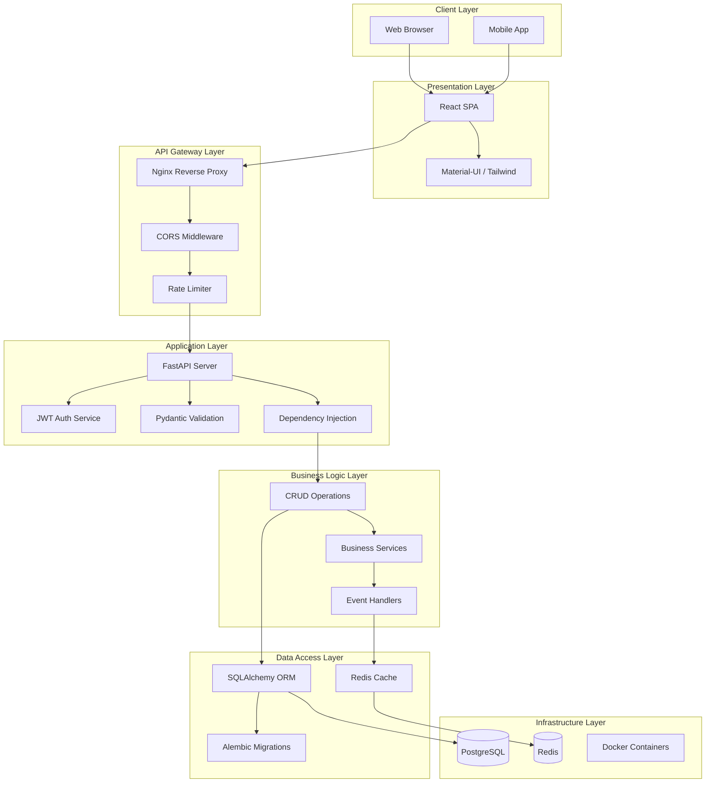
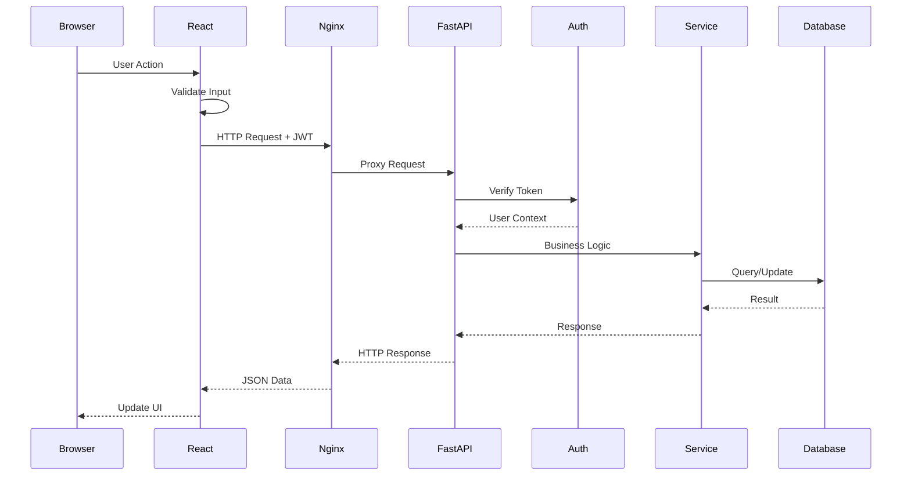
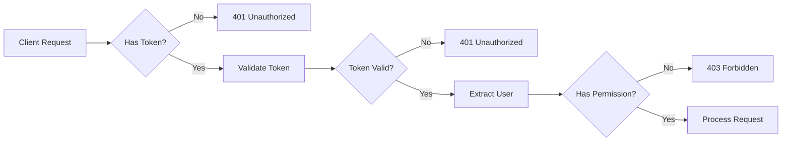
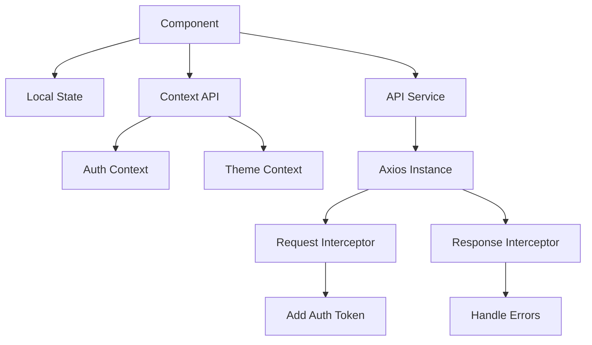
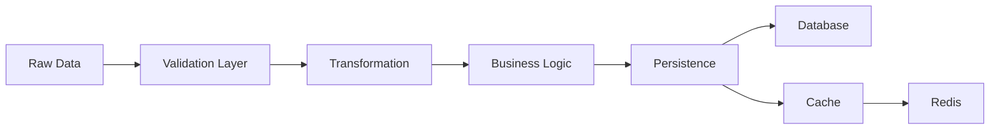
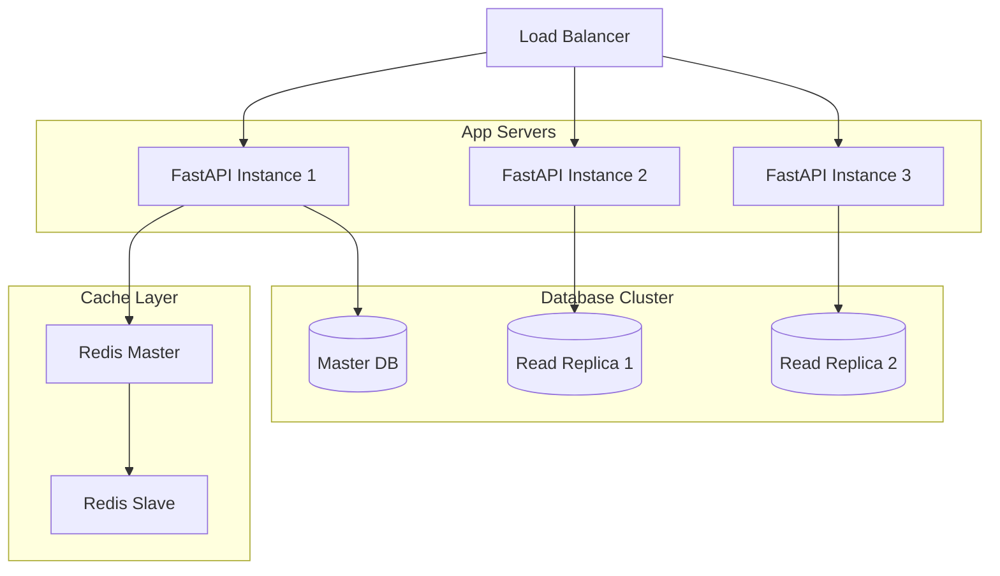
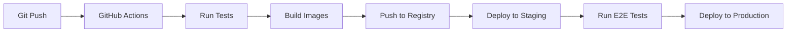

# 🏗️ Architecture Overview

Comprehensive overview of the system architecture, design patterns, and technical decisions in StackWizard-generated projects.

## 🎯 System Architecture

### High-Level Architecture Diagram



## 🔄 Request Flow

### Complete Request Lifecycle



## 🏛️ Design Patterns

### 1. **Repository Pattern**
Abstraction layer between business logic and data access.

```python
# backend/app/repositories/user_repository.py
class UserRepository:
    def __init__(self, db: Session):
        self.db = db
    
    def get_by_email(self, email: str) -> Optional[User]:
        return self.db.query(User).filter(User.email == email).first()
    
    def create(self, user_data: UserCreate) -> User:
        db_user = User(**user_data.dict())
        self.db.add(db_user)
        self.db.commit()
        return db_user
```

### 2. **Dependency Injection**
FastAPI's built-in DI system for managing dependencies.

```python
# backend/app/api/deps.py
def get_db() -> Generator:
    db = SessionLocal()
    try:
        yield db
    finally:
        db.close()

def get_current_user(
    token: str = Depends(oauth2_scheme),
    db: Session = Depends(get_db)
) -> User:
    # Token validation logic
    return user
```

### 3. **Service Layer Pattern**
Business logic separated from API endpoints.

```python
# backend/app/services/user_service.py
class UserService:
    def __init__(self, db: Session):
        self.db = db
        self.repo = UserRepository(db)
    
    def register_user(self, user_data: UserCreate) -> User:
        # Business logic: validation, password hashing, etc.
        if self.repo.get_by_email(user_data.email):
            raise ValueError("Email already registered")
        
        user_data.password = hash_password(user_data.password)
        return self.repo.create(user_data)
```

### 4. **Factory Pattern**
For creating configured instances.

```python
# backend/app/core/factory.py
def create_app() -> FastAPI:
    app = FastAPI(
        title=settings.PROJECT_NAME,
        version=settings.VERSION,
        openapi_url=f"{settings.API_V1_STR}/openapi.json"
    )
    
    # Configure middleware
    setup_middleware(app)
    
    # Configure routes
    setup_routes(app)
    
    return app
```

## 🔒 Security Architecture

### Authentication & Authorization Flow



### Security Layers

1. **Transport Security**
   - HTTPS enforced in production
   - SSL/TLS certificates via Let's Encrypt

2. **Authentication**
   - JWT tokens with expiration
   - Refresh token mechanism
   - Secure password hashing (bcrypt)

3. **Authorization**
   - Role-based access control (RBAC)
   - Resource-level permissions
   - API key authentication for services

4. **Input Validation**
   - Pydantic models for all inputs
   - SQL injection prevention via ORM
   - XSS protection in frontend

5. **Rate Limiting**
   - Per-endpoint rate limits
   - IP-based throttling
   - DDoS protection

## 🐳 Container Architecture

### Docker Compose Services

```yaml
version: '3.8'

services:
  db:
    image: postgres:15
    environment:
      POSTGRES_DB: ${DB_NAME}
      POSTGRES_USER: ${DB_USER}
      POSTGRES_PASSWORD: ${DB_PASSWORD}
    volumes:
      - postgres_data:/var/lib/postgresql/data
    healthcheck:
      test: ["CMD-SHELL", "pg_isready -U ${DB_USER}"]
      interval: 10s
      timeout: 5s
      retries: 5

  backend:
    build: ./backend
    depends_on:
      db:
        condition: service_healthy
    environment:
      DATABASE_URL: postgresql://${DB_USER}:${DB_PASSWORD}@db:5432/${DB_NAME}
    volumes:
      - ./backend:/app
    command: uvicorn app.main:app --reload --host 0.0.0.0

  frontend:
    build: ./frontend
    depends_on:
      - backend
    environment:
      REACT_APP_API_URL: http://backend:8000
    volumes:
      - ./frontend:/app
      - /app/node_modules

  nginx:
    image: nginx:alpine
    depends_on:
      - backend
      - frontend
    ports:
      - "80:80"
      - "443:443"
    volumes:
      - ./nginx.conf:/etc/nginx/nginx.conf

volumes:
  postgres_data:
```

## 📊 Data Flow Architecture

### State Management (Frontend)



### Data Processing Pipeline



## 🚀 Performance Architecture

### Optimization Strategies

1. **Backend Optimizations**
   - Async/await for I/O operations
   - Database connection pooling
   - Query optimization with indexes
   - Response caching with Redis
   - Lazy loading relationships

2. **Frontend Optimizations**
   - Code splitting
   - Lazy loading routes
   - Image optimization
   - Bundle size optimization
   - Service worker caching

3. **Database Optimizations**
   - Proper indexing strategy
   - Query optimization
   - Connection pooling
   - Read replicas for scaling
   - Partitioning for large tables

### Caching Strategy

```python
# backend/app/core/cache.py
import redis
from functools import wraps

redis_client = redis.Redis.from_url(settings.REDIS_URL)

def cache_result(expiration=3600):
    def decorator(func):
        @wraps(func)
        async def wrapper(*args, **kwargs):
            cache_key = f"{func.__name__}:{str(args)}:{str(kwargs)}"
            
            # Try to get from cache
            cached = redis_client.get(cache_key)
            if cached:
                return json.loads(cached)
            
            # Execute function
            result = await func(*args, **kwargs)
            
            # Store in cache
            redis_client.setex(
                cache_key, 
                expiration, 
                json.dumps(result)
            )
            
            return result
        return wrapper
    return decorator
```

## 🔄 Scalability Architecture

### Horizontal Scaling



### Microservices Ready

The architecture supports evolution to microservices:

1. **Service Boundaries**: Clear separation of concerns
2. **API Gateway**: Nginx can route to multiple services
3. **Message Queue Ready**: Can add RabbitMQ/Kafka
4. **Independent Databases**: Each service can have its own DB
5. **Container Orchestration**: Ready for Kubernetes

## 📈 Monitoring & Observability

### Logging Strategy

```python
# backend/app/core/logging.py
import logging
from pythonjsonlogger import jsonlogger

# Configure JSON logging
logHandler = logging.StreamHandler()
formatter = jsonlogger.JsonFormatter()
logHandler.setFormatter(formatter)

logger = logging.getLogger()
logger.addHandler(logHandler)
logger.setLevel(logging.INFO)

# Usage
logger.info("User logged in", extra={
    "user_id": user.id,
    "ip_address": request.client.host,
    "timestamp": datetime.utcnow()
})
```

### Health Checks

```python
# backend/app/api/endpoints/health.py
@router.get("/health")
async def health_check(db: Session = Depends(get_db)):
    return {
        "status": "healthy",
        "database": check_database_connection(db),
        "cache": check_redis_connection(),
        "timestamp": datetime.utcnow()
    }
```

## 🛠️ Development Architecture

### Environment Management

```bash
# Development
docker-compose up

# Testing
docker-compose -f docker-compose.test.yml up

# Production
docker-compose -f docker-compose.prod.yml up
```

### CI/CD Pipeline



---

**Next**: [Features and Capabilities](Features-and-Capabilities) →