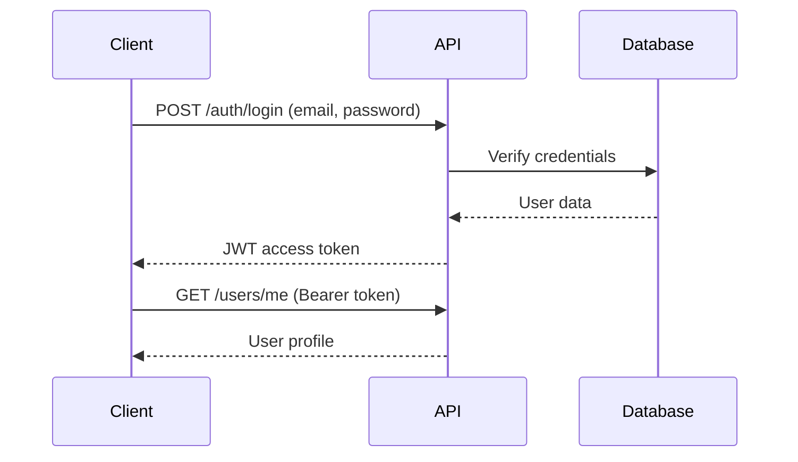

# 🚀 Backend API Endpoints

Complete documentation of all FastAPI endpoints, authentication, and request/response schemas.

## 📚 API Overview

- **Base URL**: `http://localhost:8000`
- **API Version**: `/api/v1`
- **Documentation**: `/docs` (Swagger UI)
- **Alternative Docs**: `/redoc` (ReDoc)

## 🔐 Authentication

The API uses JWT (JSON Web Tokens) for authentication.

### Authentication Flow



### Token Management

```javascript
// Request header format
Authorization: Bearer <access_token>

// Token payload
{
  "sub": "user_id",
  "exp": 1234567890,
  "iat": 1234567890
}
```

## 📋 Endpoint Documentation

### 🏥 Health Check Endpoints

#### `GET /health`
Check application health status.

**Response:**
```json
{
  "status": "healthy",
  "timestamp": "2024-01-01T00:00:00Z",
  "version": "1.0.0"
}
```

#### `GET /health/db`
Check database connection status.

**Response:**
```json
{
  "status": "connected",
  "database": "postgresql",
  "pool_size": 10,
  "active_connections": 2
}
```

---

### 🔑 Authentication Endpoints

#### `POST /api/v1/auth/register`
Register a new user account.

**Request Body:**
```json
{
  "email": "user@example.com",
  "username": "johndoe",
  "password": "SecurePassword123!",
  "full_name": "John Doe"
}
```

**Response (201):**
```json
{
  "id": "550e8400-e29b-41d4-a716-446655440000",
  "email": "user@example.com",
  "username": "johndoe",
  "full_name": "John Doe",
  "is_active": true,
  "is_superuser": false,
  "created_at": "2024-01-01T00:00:00Z"
}
```

**Error Responses:**
- `400`: Invalid input data
- `409`: Email or username already exists

---

#### `POST /api/v1/auth/login`
Authenticate user and receive access token.

**Request Body:**
```json
{
  "username": "user@example.com",  // Email or username
  "password": "SecurePassword123!"
}
```

**Response (200):**
```json
{
  "access_token": "eyJhbGciOiJIUzI1NiIsInR5cCI6IkpXVCJ9...",
  "token_type": "bearer",
  "expires_in": 1800
}
```

**Error Responses:**
- `401`: Invalid credentials
- `403`: Account inactive

---

#### `POST /api/v1/auth/refresh`
Refresh access token.

**Headers:**
```
Authorization: Bearer <current_token>
```

**Response (200):**
```json
{
  "access_token": "eyJhbGciOiJIUzI1NiIsInR5cCI6IkpXVCJ9...",
  "token_type": "bearer",
  "expires_in": 1800
}
```

---

### 👤 User Endpoints

#### `GET /api/v1/users/me`
Get current user profile.

**Headers:**
```
Authorization: Bearer <access_token>
```

**Response (200):**
```json
{
  "id": "550e8400-e29b-41d4-a716-446655440000",
  "email": "user@example.com",
  "username": "johndoe",
  "full_name": "John Doe",
  "is_active": true,
  "is_superuser": false,
  "created_at": "2024-01-01T00:00:00Z",
  "updated_at": "2024-01-01T00:00:00Z"
}
```

---

#### `PUT /api/v1/users/me`
Update current user profile.

**Headers:**
```
Authorization: Bearer <access_token>
```

**Request Body:**
```json
{
  "full_name": "John Updated Doe",
  "email": "newemail@example.com"
}
```

**Response (200):**
```json
{
  "id": "550e8400-e29b-41d4-a716-446655440000",
  "email": "newemail@example.com",
  "username": "johndoe",
  "full_name": "John Updated Doe",
  "is_active": true,
  "is_superuser": false,
  "updated_at": "2024-01-01T00:00:00Z"
}
```

---

#### `GET /api/v1/users`
Get all users (Admin only).

**Headers:**
```
Authorization: Bearer <admin_token>
```

**Query Parameters:**
- `skip` (int): Number of records to skip (default: 0)
- `limit` (int): Maximum records to return (default: 100)
- `is_active` (bool): Filter by active status

**Response (200):**
```json
{
  "items": [
    {
      "id": "550e8400-e29b-41d4-a716-446655440000",
      "email": "user@example.com",
      "username": "johndoe",
      "full_name": "John Doe",
      "is_active": true,
      "is_superuser": false
    }
  ],
  "total": 50,
  "skip": 0,
  "limit": 100
}
```

---

#### `GET /api/v1/users/{user_id}`
Get user by ID (Admin only).

**Headers:**
```
Authorization: Bearer <admin_token>
```

**Response (200):**
```json
{
  "id": "550e8400-e29b-41d4-a716-446655440000",
  "email": "user@example.com",
  "username": "johndoe",
  "full_name": "John Doe",
  "is_active": true,
  "is_superuser": false,
  "created_at": "2024-01-01T00:00:00Z"
}
```

**Error Responses:**
- `404`: User not found
- `403`: Insufficient permissions

---

### 📦 Item Endpoints

#### `POST /api/v1/items`
Create a new item.

**Headers:**
```
Authorization: Bearer <access_token>
```

**Request Body:**
```json
{
  "title": "Sample Item",
  "description": "This is a sample item",
  "price": 29.99
}
```

**Response (201):**
```json
{
  "id": "650e8400-e29b-41d4-a716-446655440001",
  "title": "Sample Item",
  "description": "This is a sample item",
  "price": 29.99,
  "owner_id": "550e8400-e29b-41d4-a716-446655440000",
  "is_available": true,
  "created_at": "2024-01-01T00:00:00Z"
}
```

---

#### `GET /api/v1/items`
Get all items with pagination.

**Query Parameters:**
- `skip` (int): Number of records to skip (default: 0)
- `limit` (int): Maximum records to return (default: 100)
- `is_available` (bool): Filter by availability
- `owner_id` (uuid): Filter by owner

**Response (200):**
```json
{
  "items": [
    {
      "id": "650e8400-e29b-41d4-a716-446655440001",
      "title": "Sample Item",
      "description": "This is a sample item",
      "price": 29.99,
      "owner": {
        "id": "550e8400-e29b-41d4-a716-446655440000",
        "username": "johndoe"
      },
      "is_available": true,
      "created_at": "2024-01-01T00:00:00Z"
    }
  ],
  "total": 150,
  "skip": 0,
  "limit": 100
}
```

---

#### `GET /api/v1/items/{item_id}`
Get item by ID.

**Response (200):**
```json
{
  "id": "650e8400-e29b-41d4-a716-446655440001",
  "title": "Sample Item",
  "description": "This is a sample item",
  "price": 29.99,
  "owner": {
    "id": "550e8400-e29b-41d4-a716-446655440000",
    "username": "johndoe",
    "email": "user@example.com"
  },
  "is_available": true,
  "created_at": "2024-01-01T00:00:00Z",
  "updated_at": "2024-01-01T00:00:00Z"
}
```

**Error Responses:**
- `404`: Item not found

---

#### `PUT /api/v1/items/{item_id}`
Update item (Owner only).

**Headers:**
```
Authorization: Bearer <access_token>
```

**Request Body:**
```json
{
  "title": "Updated Item Title",
  "description": "Updated description",
  "price": 39.99,
  "is_available": false
}
```

**Response (200):**
```json
{
  "id": "650e8400-e29b-41d4-a716-446655440001",
  "title": "Updated Item Title",
  "description": "Updated description",
  "price": 39.99,
  "is_available": false,
  "updated_at": "2024-01-01T00:00:00Z"
}
```

**Error Responses:**
- `404`: Item not found
- `403`: Not the owner

---

#### `DELETE /api/v1/items/{item_id}`
Delete item (Owner only).

**Headers:**
```
Authorization: Bearer <access_token>
```

**Response (204):**
No content

**Error Responses:**
- `404`: Item not found
- `403`: Not the owner

---

## 📝 Pydantic Schemas

### User Schemas

```python
# backend/app/schemas/user.py

class UserBase(BaseModel):
    email: EmailStr
    username: str
    full_name: Optional[str] = None
    is_active: bool = True

class UserCreate(UserBase):
    password: str

class UserUpdate(BaseModel):
    email: Optional[EmailStr] = None
    full_name: Optional[str] = None
    password: Optional[str] = None

class UserInDB(UserBase):
    id: UUID
    is_superuser: bool
    created_at: datetime
    updated_at: Optional[datetime]

class User(UserInDB):
    pass
```

### Item Schemas

```python
# backend/app/schemas/item.py

class ItemBase(BaseModel):
    title: str
    description: Optional[str] = None
    price: Decimal = Decimal("0.00")

class ItemCreate(ItemBase):
    pass

class ItemUpdate(BaseModel):
    title: Optional[str] = None
    description: Optional[str] = None
    price: Optional[Decimal] = None
    is_available: Optional[bool] = None

class ItemInDB(ItemBase):
    id: UUID
    owner_id: UUID
    is_available: bool
    created_at: datetime
    updated_at: Optional[datetime]

class Item(ItemInDB):
    owner: Optional[UserBase] = None
```

## 🛡️ Error Handling

### Standard Error Response

```json
{
  "detail": "Error message",
  "status_code": 400,
  "type": "value_error",
  "loc": ["field_name"]
}
```

### Common HTTP Status Codes

- `200`: Success
- `201`: Created
- `204`: No Content
- `400`: Bad Request
- `401`: Unauthorized
- `403`: Forbidden
- `404`: Not Found
- `409`: Conflict
- `422`: Unprocessable Entity
- `500`: Internal Server Error

## 🔄 Rate Limiting

```python
# backend/app/core/middleware.py
from slowapi import Limiter

limiter = Limiter(
    key_func=get_remote_address,
    default_limits=["100/minute"]
)

# Applied to endpoints
@router.post("/login")
@limiter.limit("5/minute")
async def login():
    pass
```

## 📊 API Testing

### Using Swagger UI

1. Navigate to `http://localhost:8000/docs`
2. Click "Authorize" button
3. Enter JWT token
4. Test endpoints directly

### Using cURL

```bash
# Login
curl -X POST "http://localhost:8000/api/v1/auth/login" \
  -H "Content-Type: application/json" \
  -d '{"username":"user@example.com","password":"password"}'

# Get profile
curl -X GET "http://localhost:8000/api/v1/users/me" \
  -H "Authorization: Bearer <token>"
```

### Using Python Requests

```python
import requests

# Login
response = requests.post(
    "http://localhost:8000/api/v1/auth/login",
    json={"username": "user@example.com", "password": "password"}
)
token = response.json()["access_token"]

# Get profile
headers = {"Authorization": f"Bearer {token}"}
profile = requests.get(
    "http://localhost:8000/api/v1/users/me",
    headers=headers
)
```

---

**Next**: [Frontend Architecture](Frontend-Architecture) →