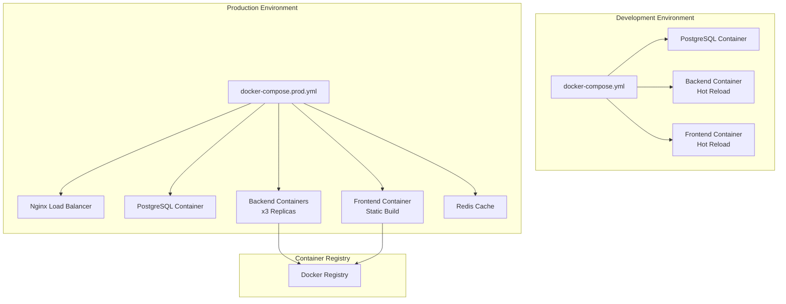

# 🐳 Docker Setup

Comprehensive guide for Docker and containerization in StackWizard-generated projects.

## 📋 Container Architecture Overview



## 🏗️ Docker Configuration Files

### Development Docker Compose

```yaml
# docker-compose.yml
version: '3.8'

services:
  db:
    image: postgres:15-alpine
    container_name: ${COMPOSE_PROJECT_NAME:-stackwizard}_db
    restart: unless-stopped
    environment:
      POSTGRES_DB: ${DB_NAME:-stackwizard_db}
      POSTGRES_USER: ${DB_USER:-stackwizard_user}
      POSTGRES_PASSWORD: ${DB_PASSWORD:-changethis}
      POSTGRES_INITDB_ARGS: "--encoding=UTF-8 --lc-collate=C --lc-ctype=C"
    volumes:
      - postgres_data:/var/lib/postgresql/data
      - ./database/init.sql:/docker-entrypoint-initdb.d/init.sql
    ports:
      - "${DB_PORT:-5432}:5432"
    networks:
      - app-network
    healthcheck:
      test: ["CMD-SHELL", "pg_isready -U ${DB_USER:-stackwizard_user} -d ${DB_NAME:-stackwizard_db}"]
      interval: 10s
      timeout: 5s
      retries: 5
    logging:
      driver: "json-file"
      options:
        max-size: "10m"
        max-file: "3"

  backend:
    build:
      context: ./backend
      dockerfile: Dockerfile
      target: development
      args:
        PYTHON_VERSION: ${PYTHON_VERSION:-3.11}
    container_name: ${COMPOSE_PROJECT_NAME:-stackwizard}_backend
    restart: unless-stopped
    environment:
      # Database
      DATABASE_URL: postgresql://${DB_USER:-stackwizard_user}:${DB_PASSWORD:-changethis}@db:5432/${DB_NAME:-stackwizard_db}
      
      # App settings
      SECRET_KEY: ${SECRET_KEY:-dev-secret-key-change-in-production}
      BACKEND_CORS_ORIGINS: '["http://localhost:3000","http://127.0.0.1:3000","http://frontend:3000"]'
      PROJECT_NAME: ${PROJECT_NAME:-StackWizard App}
      
      # Development settings
      DEBUG: "true"
      RELOAD: "true"
      LOG_LEVEL: debug
    volumes:
      # Hot reload support
      - ./backend:/app
      # Preserve compiled Python files
      - /app/__pycache__
      # Log files
      - backend_logs:/app/logs
    ports:
      - "${BACKEND_PORT:-8000}:8000"
    depends_on:
      db:
        condition: service_healthy
    networks:
      - app-network
    command: >
      bash -c "
      echo 'Waiting for database...' &&
      python -c 'import time; time.sleep(2)' &&
      alembic upgrade head &&
      echo 'Starting development server...' &&
      uvicorn app.main:app --host 0.0.0.0 --port 8000 --reload
      "
    healthcheck:
      test: ["CMD-SHELL", "curl -f http://localhost:8000/health || exit 1"]
      interval: 30s
      timeout: 10s
      retries: 3
    logging:
      driver: "json-file"
      options:
        max-size: "10m"
        max-file: "3"

  frontend:
    build:
      context: ./frontend
      dockerfile: Dockerfile
      target: development
      args:
        NODE_VERSION: ${NODE_VERSION:-18-alpine}
    container_name: ${COMPOSE_PROJECT_NAME:-stackwizard}_frontend
    restart: unless-stopped
    environment:
      # API configuration
      REACT_APP_API_URL: http://localhost:${BACKEND_PORT:-8000}
      REACT_APP_API_INTERNAL_URL: http://backend:8000
      
      # App configuration
      REACT_APP_PROJECT_NAME: ${PROJECT_NAME:-StackWizard App}
      
      # Development settings
      NODE_ENV: development
      FAST_REFRESH: true
      CHOKIDAR_USEPOLLING: true
    volumes:
      # Hot reload support
      - ./frontend:/app
      # Exclude node_modules from host
      - /app/node_modules
    ports:
      - "${FRONTEND_PORT:-3000}:3000"
    depends_on:
      - backend
    networks:
      - app-network
    command: npm start
    healthcheck:
      test: ["CMD-SHELL", "curl -f http://localhost:3000 || exit 1"]
      interval: 30s
      timeout: 10s
      retries: 3
    logging:
      driver: "json-file"
      options:
        max-size: "10m"
        max-file: "3"

volumes:
  postgres_data:
    driver: local
  backend_logs:
    driver: local

networks:
  app-network:
    driver: bridge
    ipam:
      config:
        - subnet: 172.20.0.0/16
```

### Production Docker Compose

```yaml
# docker-compose.prod.yml
version: '3.8'

services:
  db:
    image: postgres:15-alpine
    container_name: ${COMPOSE_PROJECT_NAME}_db
    restart: always
    environment:
      POSTGRES_DB: ${DB_NAME}
      POSTGRES_USER: ${DB_USER}
      POSTGRES_PASSWORD: ${DB_PASSWORD}
      POSTGRES_INITDB_ARGS: "--encoding=UTF-8"
    volumes:
      - postgres_data:/var/lib/postgresql/data
      - ./database/postgresql.conf:/etc/postgresql/postgresql.conf
    networks:
      - app-network
    command: >
      postgres
      -c shared_preload_libraries=pg_stat_statements
      -c pg_stat_statements.track=all
      -c max_connections=200
      -c shared_buffers=256MB
      -c effective_cache_size=1GB
    healthcheck:
      test: ["CMD-SHELL", "pg_isready -U ${DB_USER} -d ${DB_NAME}"]
      interval: 10s
      timeout: 5s
      retries: 5
    deploy:
      resources:
        limits:
          cpus: '1.0'
          memory: 1G
        reservations:
          cpus: '0.5'
          memory: 512M
    logging:
      driver: "json-file"
      options:
        max-size: "10m"
        max-file: "5"

  backend:
    build:
      context: ./backend
      dockerfile: Dockerfile
      target: production
    restart: always
    environment:
      DATABASE_URL: postgresql://${DB_USER}:${DB_PASSWORD}@db:5432/${DB_NAME}
      SECRET_KEY: ${SECRET_KEY}
      BACKEND_CORS_ORIGINS: ${CORS_ORIGINS}
      PROJECT_NAME: ${PROJECT_NAME}
      ENVIRONMENT: production
      LOG_LEVEL: info
    depends_on:
      db:
        condition: service_healthy
    networks:
      - app-network
    command: >
      bash -c "
      alembic upgrade head &&
      gunicorn app.main:app -w 4 -k uvicorn.workers.UvicornWorker -b 0.0.0.0:8000
      "
    healthcheck:
      test: ["CMD-SHELL", "curl -f http://localhost:8000/health || exit 1"]
      interval: 30s
      timeout: 10s
      retries: 3
    deploy:
      replicas: 3
      resources:
        limits:
          cpus: '0.5'
          memory: 512M
        reservations:
          cpus: '0.25'
          memory: 256M
    logging:
      driver: "json-file"
      options:
        max-size: "10m"
        max-file: "5"

  frontend:
    build:
      context: ./frontend
      dockerfile: Dockerfile
      target: production
    restart: always
    depends_on:
      - backend
    networks:
      - app-network
    deploy:
      replicas: 2
      resources:
        limits:
          cpus: '0.25'
          memory: 256M
        reservations:
          cpus: '0.1'
          memory: 128M

  nginx:
    image: nginx:alpine
    container_name: ${COMPOSE_PROJECT_NAME}_nginx
    restart: always
    ports:
      - "80:80"
      - "443:443"
    volumes:
      - ./nginx/nginx.conf:/etc/nginx/nginx.conf:ro
      - ./nginx/ssl:/etc/nginx/ssl:ro
      - static_files:/usr/share/nginx/html/static:ro
    depends_on:
      - backend
      - frontend
    networks:
      - app-network
    healthcheck:
      test: ["CMD-SHELL", "nginx -t"]
      interval: 30s
      timeout: 10s
      retries: 3
    logging:
      driver: "json-file"
      options:
        max-size: "10m"
        max-file: "5"

  redis:
    image: redis:7-alpine
    container_name: ${COMPOSE_PROJECT_NAME}_redis
    restart: always
    command: >
      redis-server
      --appendonly yes
      --appendfsync everysec
      --maxmemory 512mb
      --maxmemory-policy allkeys-lru
    volumes:
      - redis_data:/data
    networks:
      - app-network
    healthcheck:
      test: ["CMD-SHELL", "redis-cli ping"]
      interval: 30s
      timeout: 10s
      retries: 3
    deploy:
      resources:
        limits:
          cpus: '0.25'
          memory: 512M
        reservations:
          cpus: '0.1'
          memory: 256M

volumes:
  postgres_data:
    driver: local
  redis_data:
    driver: local
  static_files:
    driver: local

networks:
  app-network:
    driver: overlay
    attachable: true
```

## 🐍 Backend Dockerfile

```dockerfile
# backend/Dockerfile
ARG PYTHON_VERSION=3.11

# Multi-stage build
FROM python:${PYTHON_VERSION}-slim as base

# Set environment variables
ENV PYTHONUNBUFFERED=1 \
    PYTHONDONTWRITEBYTECODE=1 \
    PIP_NO_CACHE_DIR=1 \
    PIP_DISABLE_PIP_VERSION_CHECK=1

# Install system dependencies
RUN apt-get update && apt-get install -y \
    build-essential \
    curl \
    libpq-dev \
    && apt-get clean \
    && rm -rf /var/lib/apt/lists/*

# Create app user
RUN groupadd -r appuser && useradd -r -g appuser appuser

# Set work directory
WORKDIR /app

# Install Python dependencies
COPY requirements.txt requirements-dev.txt ./
RUN pip install --upgrade pip setuptools wheel

# Development stage
FROM base as development
RUN pip install -r requirements-dev.txt
COPY . .
RUN chown -R appuser:appuser /app
USER appuser
EXPOSE 8000
CMD ["uvicorn", "app.main:app", "--host", "0.0.0.0", "--port", "8000", "--reload"]

# Production stage
FROM base as production
RUN pip install -r requirements.txt \
    && pip install gunicorn uvicorn[standard]

# Copy application code
COPY . .
RUN chown -R appuser:appuser /app

# Create logs directory
RUN mkdir -p logs && chown appuser:appuser logs

# Switch to non-root user
USER appuser

# Health check
HEALTHCHECK --interval=30s --timeout=10s --start-period=60s --retries=3 \
    CMD curl -f http://localhost:8000/health || exit 1

EXPOSE 8000

CMD ["gunicorn", "app.main:app", "-w", "4", "-k", "uvicorn.workers.UvicornWorker", "-b", "0.0.0.0:8000"]
```

## ⚛️ Frontend Dockerfile

```dockerfile
# frontend/Dockerfile
ARG NODE_VERSION=18-alpine

# Multi-stage build
FROM node:${NODE_VERSION} as base

# Set working directory
WORKDIR /app

# Create app user
RUN addgroup -g 1001 -S nodejs && \
    adduser -S nextjs -u 1001

# Install dependencies
COPY package*.json ./
RUN npm ci --only=production && npm cache clean --force

# Development stage
FROM node:${NODE_VERSION} as development
WORKDIR /app
COPY package*.json ./
RUN npm ci
COPY . .
RUN chown -R node:node /app
USER node
EXPOSE 3000
CMD ["npm", "start"]

# Build stage
FROM base as builder
WORKDIR /app
COPY package*.json ./
RUN npm ci
COPY . .
RUN npm run build

# Production stage
FROM nginx:alpine as production

# Copy custom nginx configuration
COPY nginx.conf /etc/nginx/nginx.conf

# Copy built application
COPY --from=builder /app/build /usr/share/nginx/html

# Create nginx user
RUN addgroup -g 101 -S nginx && \
    adduser -S -D -H -u 101 -h /var/cache/nginx -s /sbin/nologin -G nginx -g nginx nginx

# Set permissions
RUN chown -R nginx:nginx /usr/share/nginx/html && \
    chown -R nginx:nginx /var/cache/nginx && \
    chown -R nginx:nginx /var/log/nginx && \
    chown -R nginx:nginx /etc/nginx/conf.d

# Switch to nginx user
USER nginx

# Health check
HEALTHCHECK --interval=30s --timeout=10s --start-period=30s --retries=3 \
    CMD curl -f http://localhost:80/ || exit 1

EXPOSE 80

CMD ["nginx", "-g", "daemon off;"]
```

## ⚙️ Nginx Configuration

```nginx
# frontend/nginx.conf
user nginx;
worker_processes auto;
error_log /var/log/nginx/error.log warn;
pid /var/run/nginx.pid;

events {
    worker_connections 1024;
    use epoll;
    multi_accept on;
}

http {
    include /etc/nginx/mime.types;
    default_type application/octet-stream;

    # Logging
    log_format main '$remote_addr - $remote_user [$time_local] "$request" '
                    '$status $body_bytes_sent "$http_referer" '
                    '"$http_user_agent" "$http_x_forwarded_for"';
    access_log /var/log/nginx/access.log main;

    # Performance
    sendfile on;
    tcp_nopush on;
    tcp_nodelay on;
    keepalive_timeout 65;
    types_hash_max_size 2048;
    client_max_body_size 16m;

    # Gzip compression
    gzip on;
    gzip_vary on;
    gzip_min_length 1024;
    gzip_proxied any;
    gzip_comp_level 6;
    gzip_types
        application/atom+xml
        application/javascript
        application/json
        application/ld+json
        application/manifest+json
        application/rss+xml
        application/vnd.geo+json
        application/vnd.ms-fontobject
        application/x-font-ttf
        application/x-web-app-manifest+json
        application/xhtml+xml
        application/xml
        font/opentype
        image/bmp
        image/svg+xml
        image/x-icon
        text/cache-manifest
        text/css
        text/plain
        text/vcard
        text/vnd.rim.location.xloc
        text/vtt
        text/x-component
        text/x-cross-domain-policy;

    # Security headers
    add_header X-Frame-Options "SAMEORIGIN" always;
    add_header X-Content-Type-Options "nosniff" always;
    add_header X-XSS-Protection "1; mode=block" always;
    add_header Referrer-Policy "strict-origin-when-cross-origin" always;

    server {
        listen 80;
        server_name localhost;
        root /usr/share/nginx/html;
        index index.html index.htm;

        # Handle React Router
        location / {
            try_files $uri $uri/ /index.html;
        }

        # Cache static assets
        location ~* \.(js|css|png|jpg|jpeg|gif|ico|svg|woff|woff2)$ {
            expires 1y;
            add_header Cache-Control "public, immutable";
        }

        # API proxy (optional)
        location /api {
            proxy_pass http://backend:8000;
            proxy_set_header Host $host;
            proxy_set_header X-Real-IP $remote_addr;
            proxy_set_header X-Forwarded-For $proxy_add_x_forwarded_for;
            proxy_set_header X-Forwarded-Proto $scheme;
        }

        # Health check
        location /health {
            access_log off;
            return 200 "healthy\n";
            add_header Content-Type text/plain;
        }
    }
}
```

## 🛠️ Development Commands

### Basic Operations

```bash
# Start development environment
docker-compose up -d

# View logs
docker-compose logs -f

# Stop services
docker-compose down

# Rebuild services
docker-compose up -d --build

# Clean up everything
docker-compose down -v --remove-orphans
```

### Service Management

```bash
# Start specific service
docker-compose up backend

# Scale services
docker-compose up -d --scale backend=3

# Restart service
docker-compose restart backend

# View service status
docker-compose ps

# Execute commands in container
docker-compose exec backend bash
docker-compose exec frontend sh
```

### Database Operations

```bash
# Run migrations
docker-compose exec backend alembic upgrade head

# Create migration
docker-compose exec backend alembic revision --autogenerate -m "Description"

# Database backup
docker-compose exec db pg_dump -U stackwizard_user stackwizard_db > backup.sql

# Database restore
docker-compose exec -T db psql -U stackwizard_user stackwizard_db < backup.sql

# Connect to database
docker-compose exec db psql -U stackwizard_user -d stackwizard_db
```

### Testing in Containers

```bash
# Backend tests
docker-compose exec backend pytest

# Frontend tests
docker-compose exec frontend npm test

# End-to-end tests
docker-compose -f docker-compose.test.yml up --abort-on-container-exit
```

## 🚀 Production Deployment

### Docker Swarm Deployment

```bash
# Initialize swarm
docker swarm init

# Deploy stack
docker stack deploy -c docker-compose.prod.yml stackwizard

# List services
docker service ls

# Scale service
docker service scale stackwizard_backend=5

# View service logs
docker service logs stackwizard_backend

# Update service
docker service update --image myregistry/backend:v2.0.0 stackwizard_backend
```

### Kubernetes Deployment

```yaml
# k8s/deployment.yaml
apiVersion: apps/v1
kind: Deployment
metadata:
  name: backend
spec:
  replicas: 3
  selector:
    matchLabels:
      app: backend
  template:
    metadata:
      labels:
        app: backend
    spec:
      containers:
      - name: backend
        image: myregistry/backend:latest
        ports:
        - containerPort: 8000
        env:
        - name: DATABASE_URL
          valueFrom:
            secretKeyRef:
              name: db-secret
              key: url
        resources:
          limits:
            cpu: 500m
            memory: 512Mi
          requests:
            cpu: 250m
            memory: 256Mi
        livenessProbe:
          httpGet:
            path: /health
            port: 8000
          initialDelaySeconds: 30
          periodSeconds: 10
        readinessProbe:
          httpGet:
            path: /health
            port: 8000
          initialDelaySeconds: 5
          periodSeconds: 5
```

## 📊 Monitoring & Observability

### Container Monitoring

```yaml
# docker-compose.monitoring.yml
version: '3.8'

services:
  prometheus:
    image: prom/prometheus:latest
    container_name: prometheus
    ports:
      - "9090:9090"
    volumes:
      - ./monitoring/prometheus.yml:/etc/prometheus/prometheus.yml
    networks:
      - monitoring

  grafana:
    image: grafana/grafana:latest
    container_name: grafana
    ports:
      - "3001:3000"
    environment:
      GF_SECURITY_ADMIN_PASSWORD: admin
    volumes:
      - grafana_data:/var/lib/grafana
    networks:
      - monitoring

  cadvisor:
    image: gcr.io/cadvisor/cadvisor:latest
    container_name: cadvisor
    ports:
      - "8080:8080"
    volumes:
      - /:/rootfs:ro
      - /var/run:/var/run:rw
      - /sys:/sys:ro
      - /var/lib/docker/:/var/lib/docker:ro
    networks:
      - monitoring

volumes:
  grafana_data:

networks:
  monitoring:
    external: true
```

### Health Checks

```bash
# Check container health
docker-compose ps

# Detailed health status
docker inspect --format='{{json .State.Health}}' container_name

# Custom health check script
#!/bin/bash
# scripts/health-check.sh
services=("db" "backend" "frontend")

for service in "${services[@]}"; do
    status=$(docker-compose ps -q $service | xargs docker inspect --format='{{.State.Health.Status}}')
    echo "$service: $status"
    if [ "$status" != "healthy" ]; then
        echo "Service $service is unhealthy"
        exit 1
    fi
done

echo "All services are healthy"
```

## 🔧 Troubleshooting

### Common Issues

#### Port Conflicts
```bash
# Find process using port
lsof -i :8000

# Kill process
kill -9 <PID>

# Change port in docker-compose.yml
ports:
  - "8001:8000"  # Changed from 8000:8000
```

#### Permission Issues
```bash
# Fix volume permissions
sudo chown -R $USER:$USER ./volumes/

# Run containers as current user
docker-compose exec --user $(id -u):$(id -g) backend bash
```

#### Memory Issues
```bash
# Check container resource usage
docker stats

# Set memory limits
deploy:
  resources:
    limits:
      memory: 1G
```

#### Network Issues
```bash
# List networks
docker network ls

# Inspect network
docker network inspect project_app-network

# Test connectivity between containers
docker-compose exec backend ping frontend
```

### Debugging Commands

```bash
# View container logs
docker-compose logs --tail=100 -f backend

# Execute interactive shell
docker-compose exec backend bash

# Inspect container
docker inspect container_name

# Check container processes
docker-compose exec backend ps aux

# Monitor resource usage
docker-compose exec backend top
```

## 🔒 Security Best Practices

1. **Use non-root users** in containers
2. **Keep images updated** regularly
3. **Use minimal base images** (alpine)
4. **Scan images** for vulnerabilities
5. **Limit resource usage** with constraints
6. **Use secrets management** for sensitive data
7. **Network isolation** with custom networks
8. **Read-only filesystems** where possible
9. **Security scanning** in CI/CD pipeline
10. **Regular backups** of data volumes

---

**Author**: Rafał Łagowski | [GitHub](https://github.com/rafeekpro) | [NPM](https://www.npmjs.com/~rafeekpro)