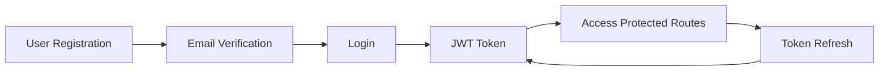

# 🎯 Features and Capabilities

Comprehensive overview of all features, capabilities, and functionalities provided by StackWizard-generated projects.

## 🚀 Core Features

### 1. **Full-Stack Project Generation**

#### CLI Features
- ✅ Interactive project setup wizard
- ✅ Command-line options for automation
- ✅ Quick mode for instant generation
- ✅ Custom project naming and configuration
- ✅ UI framework selection (Material-UI or Tailwind CSS)
- ✅ Database configuration options
- ✅ Port customization for all services
- ✅ Git repository initialization
- ✅ Automatic dependency installation option

#### Generated Project Features
- ✅ Complete backend API with FastAPI
- ✅ Modern React frontend application
- ✅ PostgreSQL database with migrations
- ✅ Docker Compose orchestration
- ✅ Development and production configurations
- ✅ Environment variable management
- ✅ Comprehensive documentation

---

## 🔐 Authentication & Security

### Authentication System


#### Features
- ✅ **JWT-based authentication**
  - Access tokens with configurable expiration
  - Refresh token mechanism
  - Secure token storage in httpOnly cookies (optional)

- ✅ **User registration**
  - Email and username validation
  - Password strength requirements
  - Duplicate user prevention
  - Email verification (optional)

- ✅ **Password management**
  - Bcrypt hashing with salt
  - Password reset via email
  - Password change functionality
  - Password history tracking (optional)

- ✅ **Session management**
  - Automatic token refresh
  - Logout functionality
  - Multi-device session tracking
  - Session invalidation

### Security Features
- ✅ **CORS configuration** - Configurable cross-origin resource sharing
- ✅ **Rate limiting** - API endpoint throttling
- ✅ **Input validation** - Pydantic models for all inputs
- ✅ **SQL injection prevention** - ORM-based queries
- ✅ **XSS protection** - React's built-in protections
- ✅ **CSRF protection** - Token-based protection
- ✅ **HTTPS enforcement** - SSL/TLS in production
- ✅ **Security headers** - Helmet.js equivalent headers

---

## 🗄️ Database Features

### Database Management
- ✅ **PostgreSQL 15** - Latest stable version
- ✅ **Connection pooling** - Optimized connection management
- ✅ **Automatic migrations** - Alembic migration system
- ✅ **Seed data** - Initial data population
- ✅ **Backup & restore** - Database backup utilities
- ✅ **Query optimization** - Indexed columns and relationships

### ORM Capabilities (SQLAlchemy)
```python
# Advanced querying examples
# Pagination
users = db.query(User).offset(skip).limit(limit).all()

# Filtering
active_users = db.query(User).filter(User.is_active == True).all()

# Joining
user_with_items = db.query(User).join(Item).filter(User.id == user_id).first()

# Aggregation
item_count = db.query(func.count(Item.id)).filter(Item.owner_id == user_id).scalar()
```

### Database Features
- ✅ UUID primary keys
- ✅ Timestamps (created_at, updated_at)
- ✅ Soft deletes
- ✅ Foreign key constraints
- ✅ Unique constraints
- ✅ Check constraints
- ✅ Database triggers (optional)
- ✅ Stored procedures (optional)

---

## 🎨 Frontend Features

### UI Frameworks

#### Material-UI Version
- ✅ Pre-built component library
- ✅ Theme customization
- ✅ Dark mode support
- ✅ Responsive grid system
- ✅ Icons and animations
- ✅ Form components
- ✅ Data tables
- ✅ Navigation components

#### Tailwind CSS Version
- ✅ Utility-first CSS
- ✅ Custom component creation
- ✅ Dark mode support
- ✅ Responsive design utilities
- ✅ Custom animations
- ✅ Form styling
- ✅ Flexbox and grid utilities
- ✅ Custom color schemes

### React Features
- ✅ **React 18** with latest features
- ✅ **React Router v6** for navigation
- ✅ **Context API** for state management
- ✅ **Custom hooks** for reusable logic
- ✅ **Error boundaries** for error handling
- ✅ **Lazy loading** for performance
- ✅ **Code splitting** for optimization
- ✅ **Progressive Web App** ready

### Component Library
```javascript
// Pre-built components
<Header />           // Navigation header
<Footer />           // Application footer
<Layout />           // Page layout wrapper
<ProtectedRoute />   // Auth-protected routes
<LoadingSpinner />   // Loading indicators
<ErrorBoundary />    // Error handling
<DataTable />        // Sortable, filterable tables
<FormValidator />    // Form validation wrapper
```

---

## 📡 API Features

### RESTful API Design
```
GET    /api/v1/users      # List users
POST   /api/v1/users      # Create user
GET    /api/v1/users/{id} # Get user
PUT    /api/v1/users/{id} # Update user
DELETE /api/v1/users/{id} # Delete user
```

### API Capabilities
- ✅ **Auto-generated documentation** (Swagger/OpenAPI)
- ✅ **Interactive API testing** (Swagger UI)
- ✅ **Alternative documentation** (ReDoc)
- ✅ **Versioned APIs** (/api/v1, /api/v2)
- ✅ **Pagination support**
- ✅ **Filtering and sorting**
- ✅ **Field selection**
- ✅ **Batch operations**
- ✅ **File uploads**
- ✅ **WebSocket support** (optional)

### Response Features
```json
{
  "data": {},           // Response data
  "meta": {            // Metadata
    "total": 100,
    "page": 1,
    "per_page": 20
  },
  "links": {           // HATEOAS links
    "self": "/api/v1/users?page=1",
    "next": "/api/v1/users?page=2"
  }
}
```

---

## 🐳 DevOps Features

### Docker Support
- ✅ **Multi-stage builds** - Optimized image sizes
- ✅ **Docker Compose** - Service orchestration
- ✅ **Health checks** - Service monitoring
- ✅ **Volume management** - Data persistence
- ✅ **Network isolation** - Service communication
- ✅ **Environment configs** - Dev/test/prod setups

### Development Features
- ✅ **Hot reload** - Automatic code reloading
- ✅ **Debug mode** - Enhanced error messages
- ✅ **Development seeds** - Test data generation
- ✅ **Mock services** - External service mocking
- ✅ **Development proxy** - API proxy configuration

### Production Features
- ✅ **Production builds** - Optimized bundles
- ✅ **Static file serving** - Nginx configuration
- ✅ **Gzip compression** - Response compression
- ✅ **Cache headers** - Browser caching
- ✅ **Load balancing ready** - Scale horizontally
- ✅ **SSL/TLS ready** - HTTPS configuration

---

## 🧪 Testing Capabilities

### Backend Testing
```python
# Test example
def test_create_user(client: TestClient, db: Session):
    response = client.post(
        "/api/v1/users/",
        json={"email": "test@example.com", "password": "testpass"}
    )
    assert response.status_code == 201
    assert response.json()["email"] == "test@example.com"
```

#### Testing Features
- ✅ Unit tests with pytest
- ✅ Integration tests
- ✅ API endpoint tests
- ✅ Database tests with transactions
- ✅ Test fixtures and factories
- ✅ Coverage reporting
- ✅ Continuous Integration ready

### Frontend Testing
```javascript
// Test example
test('renders login form', () => {
  render(<LoginForm />);
  expect(screen.getByLabelText('Email')).toBeInTheDocument();
  expect(screen.getByLabelText('Password')).toBeInTheDocument();
});
```

#### Testing Features
- ✅ Component testing with Jest
- ✅ React Testing Library
- ✅ End-to-end tests (optional)
- ✅ Snapshot testing
- ✅ Mock service workers
- ✅ Coverage reporting

---

## 📊 Monitoring & Logging

### Logging System
```python
# Structured logging
logger.info("User action", extra={
    "user_id": user.id,
    "action": "login",
    "ip": request.client.host,
    "timestamp": datetime.utcnow()
})
```

### Monitoring Features
- ✅ **Structured logging** - JSON format logs
- ✅ **Log levels** - Debug, info, warning, error
- ✅ **Request logging** - API request tracking
- ✅ **Error tracking** - Exception logging
- ✅ **Performance metrics** - Response times
- ✅ **Health endpoints** - Service status
- ✅ **Database monitoring** - Query performance
- ✅ **Container metrics** - Resource usage

---

## 🔄 Data Management

### CRUD Operations
Full CRUD implementation for all entities:

```python
# Create
new_item = crud.item.create(db, obj_in=item_data)

# Read
item = crud.item.get(db, id=item_id)
items = crud.item.get_multi(db, skip=0, limit=100)

# Update
updated_item = crud.item.update(db, db_obj=item, obj_in=update_data)

# Delete
crud.item.remove(db, id=item_id)
```

### Data Features
- ✅ **Validation** - Input/output validation
- ✅ **Serialization** - JSON serialization
- ✅ **Relationships** - One-to-many, many-to-many
- ✅ **Transactions** - ACID compliance
- ✅ **Bulk operations** - Batch insert/update
- ✅ **Soft deletes** - Logical deletion
- ✅ **Audit trails** - Change tracking
- ✅ **Data export** - CSV/JSON export

---

## 🎯 Advanced Features

### Performance Optimization
- ✅ **Caching** - Redis integration (optional)
- ✅ **CDN ready** - Static asset delivery
- ✅ **Image optimization** - Lazy loading
- ✅ **Bundle optimization** - Code splitting
- ✅ **Database indexing** - Query optimization
- ✅ **Connection pooling** - Resource management
- ✅ **Async operations** - Non-blocking I/O
- ✅ **Worker processes** - Background tasks

### Scalability Features
- ✅ **Horizontal scaling** - Multiple instances
- ✅ **Load balancing** - Traffic distribution
- ✅ **Database replication** - Read replicas
- ✅ **Caching layer** - Redis/Memcached
- ✅ **Message queues** - Async processing (optional)
- ✅ **Microservices ready** - Service separation
- ✅ **Container orchestration** - Kubernetes ready
- ✅ **Auto-scaling** - Dynamic resource allocation

### Integration Capabilities
- ✅ **Email service** - SMTP integration
- ✅ **File storage** - S3 compatible
- ✅ **Payment processing** - Stripe/PayPal ready
- ✅ **OAuth providers** - Google/Facebook/GitHub
- ✅ **SMS service** - Twilio integration
- ✅ **Push notifications** - FCM/APNS
- ✅ **Analytics** - Google Analytics/Mixpanel
- ✅ **Error tracking** - Sentry integration

---

## 📱 Mobile & PWA Support

### Progressive Web App
- ✅ Service worker registration
- ✅ Offline capability
- ✅ App manifest
- ✅ Install prompts
- ✅ Push notifications
- ✅ Background sync
- ✅ Cache strategies

### Mobile Optimization
- ✅ Responsive design
- ✅ Touch gestures
- ✅ Mobile-first approach
- ✅ Viewport optimization
- ✅ Performance budgets
- ✅ Lazy loading images
- ✅ Reduced motion support

---

## 🌐 Internationalization

### i18n Support (Optional)
- ✅ Multi-language support
- ✅ Locale detection
- ✅ Translation management
- ✅ Number formatting
- ✅ Date formatting
- ✅ Currency formatting
- ✅ RTL support
- ✅ Pluralization

---

## 📈 Business Features

### Analytics & Reporting
- ✅ User analytics
- ✅ API usage metrics
- ✅ Performance monitoring
- ✅ Error rate tracking
- ✅ Business KPIs
- ✅ Custom dashboards
- ✅ Export capabilities
- ✅ Scheduled reports

### Admin Panel (Optional)
- ✅ User management
- ✅ Content management
- ✅ System configuration
- ✅ Activity logs
- ✅ Role management
- ✅ Permission settings
- ✅ Backup management
- ✅ System health

---

## 🔮 Future-Ready Features

### Extensibility
- ✅ Plugin architecture
- ✅ Custom middleware
- ✅ Hook system
- ✅ Event-driven architecture
- ✅ API extensibility
- ✅ Theme system
- ✅ Module system
- ✅ Configuration management

### Technology Upgrades
- ✅ Framework updates
- ✅ Library upgrades
- ✅ Security patches
- ✅ Performance improvements
- ✅ New feature adoption
- ✅ Breaking change management
- ✅ Migration guides
- ✅ Backward compatibility

---

**Author**: Rafał Łagowski | [GitHub](https://github.com/rafeekpro) | [NPM](https://www.npmjs.com/~rafeekpro)