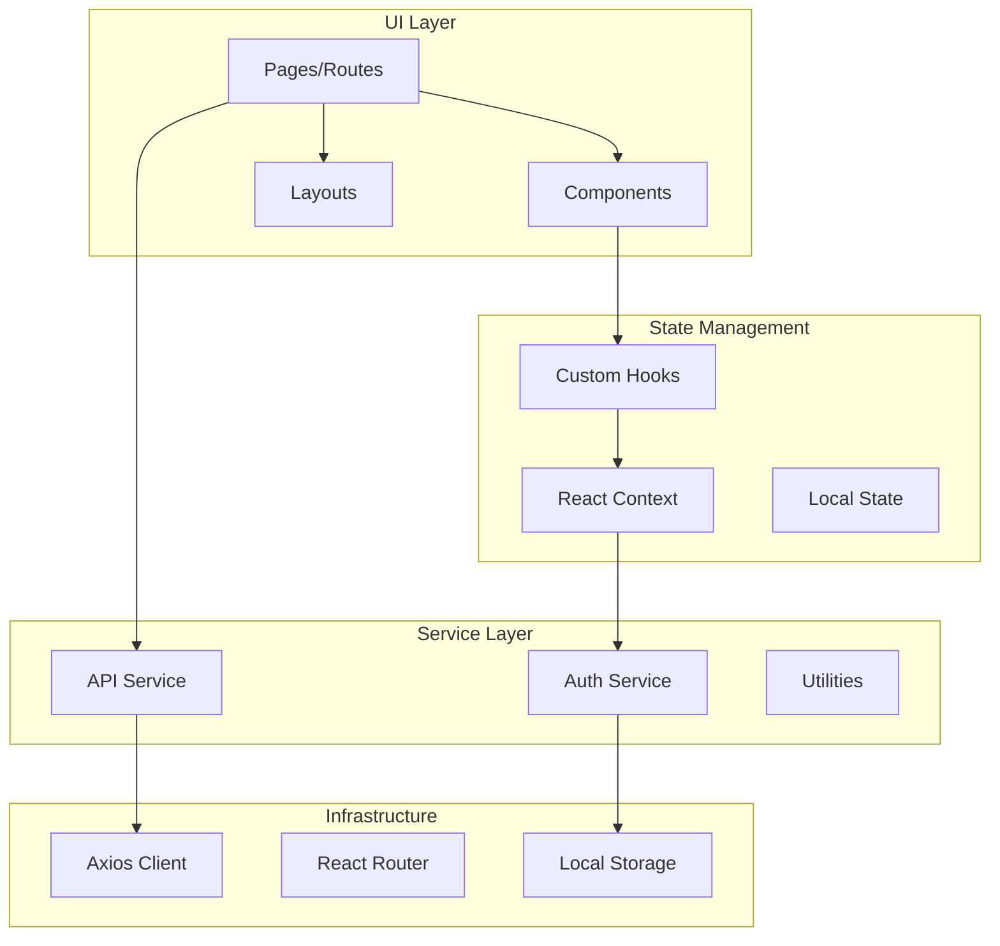

# ⚛️ Frontend Architecture

Comprehensive overview of the React frontend architecture in StackWizard-generated projects.

## 🏗️ Architecture Overview



## 📁 Frontend Structure

```
frontend/
├── src/
│   ├── components/          # Reusable UI components
│   │   ├── common/          # Shared components
│   │   ├── auth/            # Authentication components
│   │   ├── forms/           # Form components
│   │   └── layout/          # Layout components
│   ├── pages/               # Page components (routes)
│   ├── services/            # API and external services
│   ├── contexts/            # React contexts
│   ├── hooks/               # Custom React hooks
│   ├── utils/               # Utility functions
│   ├── styles/              # Global styles and themes
│   ├── assets/              # Static assets
│   ├── App.js               # Main application component
│   └── index.js             # Application entry point
├── public/                  # Public assets
├── package.json            # Dependencies
└── Dockerfile              # Container configuration
```

## 🎨 UI Framework Options

### Material-UI Architecture

```javascript
// Theme configuration
import { createTheme, ThemeProvider } from '@mui/material/styles';

const theme = createTheme({
  palette: {
    primary: {
      main: '#1976d2',
    },
    secondary: {
      main: '#dc004e',
    },
    mode: 'light', // or 'dark'
  },
  typography: {
    fontFamily: '"Roboto", "Helvetica", "Arial", sans-serif',
    h1: {
      fontSize: '2.5rem',
      fontWeight: 500,
    },
  },
  components: {
    MuiButton: {
      styleOverrides: {
        root: {
          borderRadius: 8,
        },
      },
    },
  },
});

// App.js
function App() {
  return (
    <ThemeProvider theme={theme}>
      <CssBaseline />
      <Router>
        <Routes>
          {/* Your routes */}
        </Routes>
      </Router>
    </ThemeProvider>
  );
}
```

### Tailwind CSS Architecture

```javascript
// tailwind.config.js
module.exports = {
  content: ["./src/**/*.{js,jsx,ts,tsx}"],
  darkMode: 'class',
  theme: {
    extend: {
      colors: {
        primary: {
          50: '#eff6ff',
          500: '#3b82f6',
          900: '#1e3a8a',
        },
      },
      animation: {
        'fade-in': 'fadeIn 0.5s ease-in-out',
        'slide-up': 'slideUp 0.3s ease-out',
      },
    },
  },
  plugins: [
    require('@tailwindcss/forms'),
    require('@tailwindcss/typography'),
  ],
};
```

## 🔄 State Management

### Context API Architecture

```javascript
// contexts/AuthContext.js
import React, { createContext, useState, useContext, useEffect } from 'react';
import { authService } from '../services/auth';

const AuthContext = createContext(null);

export const useAuth = () => {
  const context = useContext(AuthContext);
  if (!context) {
    throw new Error('useAuth must be used within AuthProvider');
  }
  return context;
};

export const AuthProvider = ({ children }) => {
  const [user, setUser] = useState(null);
  const [loading, setLoading] = useState(true);
  const [error, setError] = useState(null);

  useEffect(() => {
    loadUser();
  }, []);

  const loadUser = async () => {
    try {
      const token = localStorage.getItem('access_token');
      if (token) {
        const userData = await authService.getCurrentUser();
        setUser(userData);
      }
    } catch (err) {
      setError(err.message);
    } finally {
      setLoading(false);
    }
  };

  const login = async (credentials) => {
    try {
      const response = await authService.login(credentials);
      localStorage.setItem('access_token', response.access_token);
      await loadUser();
      return { success: true };
    } catch (err) {
      setError(err.message);
      return { success: false, error: err.message };
    }
  };

  const logout = () => {
    localStorage.removeItem('access_token');
    setUser(null);
  };

  const value = {
    user,
    login,
    logout,
    loading,
    error,
    isAuthenticated: !!user,
  };

  return (
    <AuthContext.Provider value={value}>
      {children}
    </AuthContext.Provider>
  );
};
```

### Custom Hooks

```javascript
// hooks/useApi.js
import { useState, useEffect } from 'react';
import api from '../services/api';

export const useApi = (url, options = {}) => {
  const [data, setData] = useState(null);
  const [loading, setLoading] = useState(true);
  const [error, setError] = useState(null);

  useEffect(() => {
    const fetchData = async () => {
      try {
        setLoading(true);
        const response = await api.get(url, options);
        setData(response.data);
      } catch (err) {
        setError(err);
      } finally {
        setLoading(false);
      }
    };

    if (url) {
      fetchData();
    }
  }, [url]);

  const refetch = async () => {
    setLoading(true);
    try {
      const response = await api.get(url, options);
      setData(response.data);
      setError(null);
    } catch (err) {
      setError(err);
    } finally {
      setLoading(false);
    }
  };

  return { data, loading, error, refetch };
};

// hooks/useDebounce.js
export const useDebounce = (value, delay) => {
  const [debouncedValue, setDebouncedValue] = useState(value);

  useEffect(() => {
    const handler = setTimeout(() => {
      setDebouncedValue(value);
    }, delay);

    return () => clearTimeout(handler);
  }, [value, delay]);

  return debouncedValue;
};
```

## 🛣️ Routing Architecture

```javascript
// App.js - Routing setup
import { BrowserRouter as Router, Routes, Route, Navigate } from 'react-router-dom';
import { AuthProvider } from './contexts/AuthContext';
import ProtectedRoute from './components/auth/ProtectedRoute';

// Pages
import Home from './pages/Home';
import Login from './pages/Login';
import Dashboard from './pages/Dashboard';
import Profile from './pages/Profile';
import Items from './pages/Items';

function App() {
  return (
    <AuthProvider>
      <Router>
        <Routes>
          {/* Public routes */}
          <Route path="/" element={<Home />} />
          <Route path="/login" element={<Login />} />
          <Route path="/register" element={<Register />} />
          
          {/* Protected routes */}
          <Route element={<ProtectedRoute />}>
            <Route path="/dashboard" element={<Dashboard />} />
            <Route path="/profile" element={<Profile />} />
            <Route path="/items" element={<Items />} />
            <Route path="/items/:id" element={<ItemDetail />} />
          </Route>
          
          {/* Fallback */}
          <Route path="*" element={<Navigate to="/" />} />
        </Routes>
      </Router>
    </AuthProvider>
  );
}

// components/auth/ProtectedRoute.js
import { Navigate, Outlet } from 'react-router-dom';
import { useAuth } from '../../contexts/AuthContext';
import LoadingSpinner from '../common/LoadingSpinner';

const ProtectedRoute = () => {
  const { isAuthenticated, loading } = useAuth();
  
  if (loading) {
    return <LoadingSpinner />;
  }
  
  return isAuthenticated ? <Outlet /> : <Navigate to="/login" />;
};
```

## 📡 API Service Layer

```javascript
// services/api.js
import axios from 'axios';

const API_URL = process.env.REACT_APP_API_URL || 'http://localhost:8000';

const api = axios.create({
  baseURL: `${API_URL}/api/v1`,
  headers: {
    'Content-Type': 'application/json',
  },
});

// Request interceptor
api.interceptors.request.use(
  (config) => {
    const token = localStorage.getItem('access_token');
    if (token) {
      config.headers.Authorization = `Bearer ${token}`;
    }
    return config;
  },
  (error) => {
    return Promise.reject(error);
  }
);

// Response interceptor
api.interceptors.response.use(
  (response) => response,
  async (error) => {
    const originalRequest = error.config;
    
    if (error.response?.status === 401 && !originalRequest._retry) {
      originalRequest._retry = true;
      
      try {
        const refreshToken = localStorage.getItem('refresh_token');
        const response = await axios.post(`${API_URL}/api/v1/auth/refresh`, {
          refresh_token: refreshToken,
        });
        
        localStorage.setItem('access_token', response.data.access_token);
        api.defaults.headers.Authorization = `Bearer ${response.data.access_token}`;
        
        return api(originalRequest);
      } catch (refreshError) {
        // Redirect to login
        window.location.href = '/login';
        return Promise.reject(refreshError);
      }
    }
    
    return Promise.reject(error);
  }
);

export default api;

// services/users.js
import api from './api';

export const userService = {
  getAll: (params) => api.get('/users', { params }),
  getById: (id) => api.get(`/users/${id}`),
  create: (data) => api.post('/users', data),
  update: (id, data) => api.put(`/users/${id}`, data),
  delete: (id) => api.delete(`/users/${id}`),
  getProfile: () => api.get('/users/me'),
  updateProfile: (data) => api.put('/users/me', data),
};
```

## 🧩 Component Architecture

### Component Structure

```javascript
// components/common/DataTable.js
import React, { useState, useMemo } from 'react';
import {
  Table,
  TableHead,
  TableBody,
  TableRow,
  TableCell,
  TablePagination,
  TableSortLabel,
  TextField,
  Box,
} from '@mui/material';

const DataTable = ({
  columns,
  data,
  onRowClick,
  searchable = true,
  sortable = true,
  paginated = true,
}) => {
  const [page, setPage] = useState(0);
  const [rowsPerPage, setRowsPerPage] = useState(10);
  const [orderBy, setOrderBy] = useState('');
  const [order, setOrder] = useState('asc');
  const [searchTerm, setSearchTerm] = useState('');

  // Filtering logic
  const filteredData = useMemo(() => {
    if (!searchTerm) return data;
    
    return data.filter((row) =>
      columns.some((column) =>
        String(row[column.field])
          .toLowerCase()
          .includes(searchTerm.toLowerCase())
      )
    );
  }, [data, searchTerm, columns]);

  // Sorting logic
  const sortedData = useMemo(() => {
    if (!orderBy) return filteredData;
    
    return [...filteredData].sort((a, b) => {
      const aValue = a[orderBy];
      const bValue = b[orderBy];
      
      if (order === 'asc') {
        return aValue < bValue ? -1 : 1;
      }
      return aValue > bValue ? -1 : 1;
    });
  }, [filteredData, orderBy, order]);

  // Pagination logic
  const paginatedData = useMemo(() => {
    if (!paginated) return sortedData;
    
    return sortedData.slice(
      page * rowsPerPage,
      page * rowsPerPage + rowsPerPage
    );
  }, [sortedData, page, rowsPerPage, paginated]);

  const handleSort = (field) => {
    const isAsc = orderBy === field && order === 'asc';
    setOrder(isAsc ? 'desc' : 'asc');
    setOrderBy(field);
  };

  return (
    <Box>
      {searchable && (
        <TextField
          fullWidth
          variant="outlined"
          placeholder="Search..."
          value={searchTerm}
          onChange={(e) => setSearchTerm(e.target.value)}
          sx={{ mb: 2 }}
        />
      )}
      
      <Table>
        <TableHead>
          <TableRow>
            {columns.map((column) => (
              <TableCell key={column.field}>
                {sortable ? (
                  <TableSortLabel
                    active={orderBy === column.field}
                    direction={orderBy === column.field ? order : 'asc'}
                    onClick={() => handleSort(column.field)}
                  >
                    {column.headerName}
                  </TableSortLabel>
                ) : (
                  column.headerName
                )}
              </TableCell>
            ))}
          </TableRow>
        </TableHead>
        <TableBody>
          {paginatedData.map((row, index) => (
            <TableRow
              key={row.id || index}
              onClick={() => onRowClick?.(row)}
              hover
              style={{ cursor: onRowClick ? 'pointer' : 'default' }}
            >
              {columns.map((column) => (
                <TableCell key={column.field}>
                  {column.render
                    ? column.render(row[column.field], row)
                    : row[column.field]}
                </TableCell>
              ))}
            </TableRow>
          ))}
        </TableBody>
      </Table>
      
      {paginated && (
        <TablePagination
          component="div"
          count={sortedData.length}
          page={page}
          onPageChange={(e, newPage) => setPage(newPage)}
          rowsPerPage={rowsPerPage}
          onRowsPerPageChange={(e) => {
            setRowsPerPage(parseInt(e.target.value, 10));
            setPage(0);
          }}
        />
      )}
    </Box>
  );
};

export default DataTable;
```

## 🎯 Performance Optimization

### Code Splitting

```javascript
// Lazy loading routes
import React, { lazy, Suspense } from 'react';
import LoadingSpinner from './components/common/LoadingSpinner';

const Dashboard = lazy(() => import('./pages/Dashboard'));
const Profile = lazy(() => import('./pages/Profile'));
const Items = lazy(() => import('./pages/Items'));

function App() {
  return (
    <Suspense fallback={<LoadingSpinner />}>
      <Routes>
        <Route path="/dashboard" element={<Dashboard />} />
        <Route path="/profile" element={<Profile />} />
        <Route path="/items" element={<Items />} />
      </Routes>
    </Suspense>
  );
}
```

### Memoization

```javascript
// Optimized component with memo
import React, { memo, useMemo, useCallback } from 'react';

const ExpensiveComponent = memo(({ data, onUpdate }) => {
  // Memoize expensive calculations
  const processedData = useMemo(() => {
    return data.map(item => ({
      ...item,
      computed: heavyComputation(item),
    }));
  }, [data]);

  // Memoize callbacks
  const handleClick = useCallback((id) => {
    onUpdate(id);
  }, [onUpdate]);

  return (
    <div>
      {processedData.map(item => (
        <div key={item.id} onClick={() => handleClick(item.id)}>
          {item.computed}
        </div>
      ))}
    </div>
  );
});
```

## 🧪 Testing Architecture

```javascript
// Example test file
import { render, screen, fireEvent, waitFor } from '@testing-library/react';
import userEvent from '@testing-library/user-event';
import { AuthProvider } from '../contexts/AuthContext';
import Login from '../pages/Login';

describe('Login Page', () => {
  test('renders login form', () => {
    render(
      <AuthProvider>
        <Login />
      </AuthProvider>
    );
    
    expect(screen.getByLabelText(/email/i)).toBeInTheDocument();
    expect(screen.getByLabelText(/password/i)).toBeInTheDocument();
    expect(screen.getByRole('button', { name: /login/i })).toBeInTheDocument();
  });

  test('handles form submission', async () => {
    const user = userEvent.setup();
    
    render(
      <AuthProvider>
        <Login />
      </AuthProvider>
    );
    
    await user.type(screen.getByLabelText(/email/i), 'test@example.com');
    await user.type(screen.getByLabelText(/password/i), 'password123');
    await user.click(screen.getByRole('button', { name: /login/i }));
    
    await waitFor(() => {
      expect(screen.getByText(/logging in/i)).toBeInTheDocument();
    });
  });
});
```

## 📱 Responsive Design

### Breakpoints (Material-UI)

```javascript
const useStyles = makeStyles((theme) => ({
  container: {
    padding: theme.spacing(2),
    [theme.breakpoints.up('sm')]: {
      padding: theme.spacing(3),
    },
    [theme.breakpoints.up('md')]: {
      padding: theme.spacing(4),
    },
  },
}));
```

### Breakpoints (Tailwind CSS)

```html
<div class="p-4 sm:p-6 md:p-8 lg:p-10">
  <h1 class="text-xl sm:text-2xl md:text-3xl lg:text-4xl">
    Responsive Title
  </h1>
  <div class="grid grid-cols-1 sm:grid-cols-2 md:grid-cols-3 lg:grid-cols-4 gap-4">
    <!-- Grid items -->
  </div>
</div>
```

## 🔐 Security Best Practices

1. **XSS Prevention**: React automatically escapes values
2. **CSRF Protection**: Token-based authentication
3. **Secure Storage**: Use httpOnly cookies for sensitive data
4. **Input Validation**: Client-side validation with server verification
5. **HTTPS**: Always use HTTPS in production
6. **Content Security Policy**: Configure CSP headers
7. **Dependency Updates**: Regular security audits with `npm audit`

---

**Next**: [Installation Guide](Installation-Guide) →