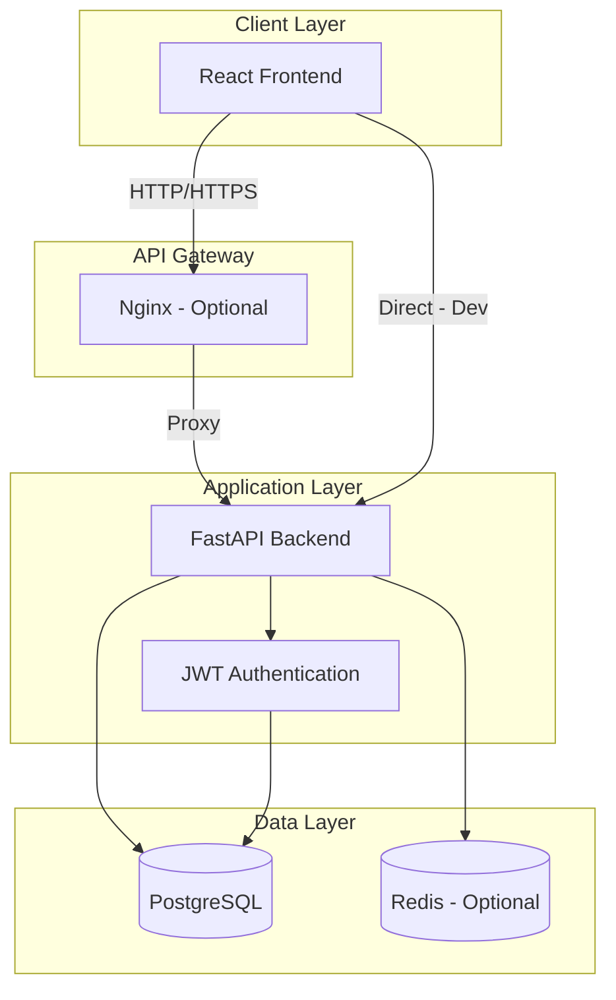

# 🧙‍♂️ StackWizard Wiki

Welcome to the **StackWizard** documentation! This wiki provides comprehensive information about the architecture, features, and capabilities of the StackWizard full-stack project generator.

## 📚 Documentation Overview

### Core Documentation
- [**Project Structure**](Project-Structure) - Complete directory layout and file organization
- [**Architecture Overview**](Architecture-Overview) - System architecture and design patterns
- [**Database Schema**](Database-Schema) - PostgreSQL database structure and relationships
- [**Backend API**](Backend-API-Endpoints) - FastAPI endpoints and authentication
- [**Frontend Architecture**](Frontend-Architecture) - React components and routing
- [**Features & Capabilities**](Features-and-Capabilities) - Complete feature list

### Technical Guides
- [**Installation Guide**](Installation-Guide) - Step-by-step setup instructions
- [**Configuration**](Configuration) - Environment variables and settings
- [**Docker Setup**](Docker-Setup) - Container orchestration details
- [**Development Workflow**](Development-Workflow) - Best practices and tips

## 🚀 Quick Links

- 📦 [NPM Package](https://www.npmjs.com/package/@rafeekpro/stackwizard)
- 🐙 [GitHub Repository](https://github.com/rafeekpro/stackwizard)
- 🐛 [Report Issues](https://github.com/rafeekpro/stackwizard/issues)
- 💬 [Discussions](https://github.com/rafeekpro/stackwizard/discussions)

## 🎯 What is StackWizard?

StackWizard is a powerful CLI tool that generates production-ready full-stack applications with a single command. It creates a complete project structure with:

- **Backend**: FastAPI with SQLAlchemy ORM, JWT authentication, and Alembic migrations
- **Frontend**: React with Material-UI or Tailwind CSS
- **Database**: PostgreSQL with optimized configuration
- **DevOps**: Docker Compose for containerized development

## 🏗️ Technology Stack

### Backend Technologies
- **FastAPI** - Modern, fast web framework for building APIs
- **SQLAlchemy** - SQL toolkit and Object-Relational Mapping
- **Alembic** - Database migration tool
- **Pydantic** - Data validation using Python type annotations
- **JWT** - JSON Web Tokens for authentication
- **Uvicorn** - Lightning-fast ASGI server

### Frontend Technologies
- **React 18** - Component-based UI library
- **React Router** - Declarative routing
- **Axios** - Promise-based HTTP client
- **Material-UI** or **Tailwind CSS** - UI frameworks
- **Context API** - State management

### Infrastructure
- **PostgreSQL 15** - Advanced open-source database
- **Docker** - Containerization platform
- **Docker Compose** - Multi-container orchestration
- **Nginx** (optional) - Reverse proxy server
- **Redis** (optional) - In-memory data store

## 📊 Architecture Diagram



## 🎨 Generated Project Structure Overview

```
your-project/
├── backend/              # FastAPI application
│   ├── app/             # Application code
│   ├── alembic/         # Database migrations
│   └── tests/           # Backend tests
├── frontend/            # React application
│   ├── src/            # Source code
│   └── public/         # Static assets
├── database/           # DB initialization
├── docker-compose.yml  # Container orchestration
└── .env               # Environment config
```

## 📈 Key Features

- ✅ **Production-Ready** - Best practices and optimized configuration
- ✅ **Full Authentication** - JWT-based auth with secure password hashing
- ✅ **Database Migrations** - Alembic for version-controlled schema changes
- ✅ **API Documentation** - Auto-generated Swagger/OpenAPI docs
- ✅ **Type Safety** - Full TypeScript support and Python type hints
- ✅ **Hot Reload** - Development mode with automatic reloading
- ✅ **Docker Support** - Complete containerization with health checks
- ✅ **CRUD Examples** - Working examples for Users and Items
- ✅ **Responsive Design** - Mobile-first UI approach
- ✅ **Error Handling** - Comprehensive error handling and validation

## 👨‍💻 Author

**Rafał Łagowski** - Full-Stack Developer
- GitHub: [@rafeekpro](https://github.com/rafeekpro)
- NPM: [@rafeekpro](https://www.npmjs.com/~rafeekpro)

---

*Last updated: 2024*