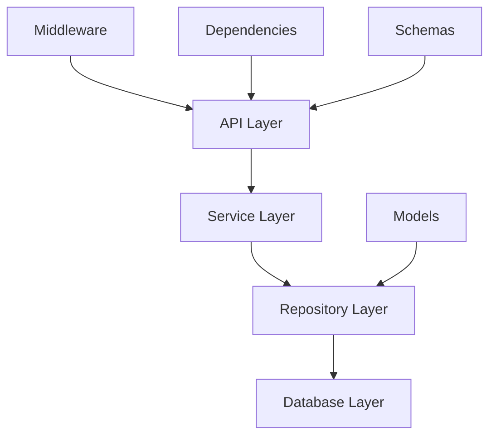

# Backend Architecture 🏗️

## Overview

The generated FastAPI backend follows clean architecture principles with clear separation of concerns, making it scalable, testable, and maintainable.

## Architecture Layers



## Directory Structure

```
backend/
├── app/
│   ├── api/
│   │   ├── v1/
│   │   │   ├── users/         # User endpoints module
│   │   │   │   ├── __init__.py
│   │   │   │   ├── profile.py
│   │   │   │   ├── management.py
│   │   │   │   ├── statistics.py
│   │   │   │   └── export.py
│   │   │   ├── auth.py        # Authentication
│   │   │   ├── items.py       # Items CRUD
│   │   │   └── admin.py       # Admin endpoints
│   │   └── health.py          # Health checks
│   ├── core/
│   │   ├── config.py          # Settings
│   │   ├── dependencies.py    # Dependency injection
│   │   └── exceptions.py      # Custom exceptions
│   ├── middleware/
│   │   ├── rate_limiter.py    # Rate limiting
│   │   ├── csrf_protection.py # CSRF protection
│   │   ├── security_headers.py # Security headers
│   │   └── error_handler.py   # Global error handling
│   ├── services/
│   │   ├── base_service.py    # Base service class
│   │   ├── user_service.py    # User business logic
│   │   ├── item_service.py    # Item business logic
│   │   └── admin_service.py   # Admin operations
│   ├── repositories/
│   │   ├── base_repository.py # Base repository
│   │   └── user_repository.py # User data access
│   ├── models/
│   │   ├── user.py           # User model
│   │   └── item.py           # Item model
│   ├── schemas/
│   │   ├── user.py           # User schemas
│   │   └── item.py           # Item schemas
│   └── main.py               # Application entry
├── alembic/                   # Database migrations
├── tests/                     # Test suite
└── requirements.txt           # Dependencies
```

## Key Components

### 1. Service Layer Pattern

```python
class UserService(BaseService[User, UserCreate, UserUpdate]):
    """Business logic for user operations"""
    
    async def create_with_validation(self, data: UserCreate) -> User:
        # Business rules
        if await self.email_exists(data.email):
            raise EmailAlreadyExists()
        
        # Create user
        return await self.repository.create(data)
    
    async def get_with_items(self, user_id: int) -> UserWithItems:
        # Complex query with relationships
        return await self.repository.get_with_relations(
            user_id, 
            relations=["items"]
        )
```

### 2. Repository Pattern

```python
class UserRepository(BaseRepository[User]):
    """Data access layer for users"""
    
    async def find_by_email(self, email: str) -> Optional[User]:
        query = select(User).where(User.email == email)
        result = await self.db.execute(query)
        return result.scalar_one_or_none()
    
    async def bulk_create(self, users: List[UserCreate]) -> List[User]:
        # Efficient bulk operations
        db_users = [User(**user.dict()) for user in users]
        self.db.add_all(db_users)
        await self.db.commit()
        return db_users
```

### 3. Dependency Injection

```python
async def get_user_service(
    db: AsyncSession = Depends(get_db)
) -> UserService:
    repository = UserRepository(db)
    return UserService(repository)

@router.post("/users/")
async def create_user(
    user_data: UserCreate,
    service: UserService = Depends(get_user_service)
):
    return await service.create(user_data)
```

## Security Features

### Authentication & Authorization

- **JWT Tokens** with refresh token rotation
- **Role-based access control** (admin, user)
- **Password hashing** with bcrypt
- **Token blacklisting** for logout

### Security Middleware

#### Rate Limiting
```python
limiter = Limiter(
    key_func=get_user_id,
    default_limits=["60/minute", "1000/hour"]
)

@limiter.limit("5/minute")
async def login(credentials: OAuth2PasswordRequestForm):
    # Login logic
```

#### CSRF Protection
```python
class CSRFProtectionMiddleware:
    async def __call__(self, request: Request, call_next):
        if request.method in ["POST", "PUT", "DELETE"]:
            csrf_token = request.headers.get("X-CSRF-Token")
            if not self.validate_token(csrf_token):
                raise CSRFError()
        return await call_next(request)
```

#### Security Headers
```python
security_headers = {
    "X-Content-Type-Options": "nosniff",
    "X-Frame-Options": "DENY",
    "X-XSS-Protection": "1; mode=block",
    "Strict-Transport-Security": "max-age=31536000",
}
```

## Database Design

### Models

```python
class User(Base):
    __tablename__ = "users"
    
    id = Column(Integer, primary_key=True)
    email = Column(String, unique=True, index=True)
    username = Column(String, unique=True, index=True)
    hashed_password = Column(String)
    is_active = Column(Boolean, default=True)
    is_admin = Column(Boolean, default=False)
    created_at = Column(DateTime, default=datetime.utcnow)
    updated_at = Column(DateTime, onupdate=datetime.utcnow)
    
    # Relationships
    items = relationship("Item", back_populates="owner")
    refresh_tokens = relationship("RefreshToken", back_populates="user")
```

### Migrations with Alembic

```bash
# Create migration
alembic revision --autogenerate -m "Add user table"

# Apply migrations
alembic upgrade head

# Rollback
alembic downgrade -1
```

## API Endpoints

### RESTful Routes

| Method | Endpoint | Description | Auth Required |
|--------|----------|-------------|---------------|
| POST | `/api/v1/auth/login` | User login | No |
| POST | `/api/v1/auth/refresh` | Refresh token | Yes |
| POST | `/api/v1/auth/logout` | User logout | Yes |
| GET | `/api/v1/users/me` | Current user | Yes |
| PUT | `/api/v1/users/me` | Update profile | Yes |
| GET | `/api/v1/users/` | List users | Admin |
| POST | `/api/v1/users/` | Create user | Admin |
| DELETE | `/api/v1/users/{id}` | Delete user | Admin |
| GET | `/api/v1/items/` | List items | Yes |
| POST | `/api/v1/items/` | Create item | Yes |

## Error Handling

### Custom Exceptions

```python
class AppException(Exception):
    def __init__(
        self,
        status_code: int,
        detail: str,
        error_code: str = None
    ):
        self.status_code = status_code
        self.detail = detail
        self.error_code = error_code

class UserNotFound(AppException):
    def __init__(self):
        super().__init__(
            status_code=404,
            detail="User not found",
            error_code="USER_NOT_FOUND"
        )
```

### Global Error Handler

```python
@app.exception_handler(AppException)
async def app_exception_handler(request: Request, exc: AppException):
    return JSONResponse(
        status_code=exc.status_code,
        content={
            "error": exc.error_code,
            "detail": exc.detail,
            "timestamp": datetime.utcnow().isoformat(),
            "path": request.url.path
        }
    )
```

## Testing

### Unit Tests

```python
async def test_create_user(user_service):
    user_data = UserCreate(
        email="test@example.com",
        username="testuser",
        password="Test123!"
    )
    
    user = await user_service.create(user_data)
    
    assert user.email == user_data.email
    assert user.username == user_data.username
```

### Integration Tests

```python
async def test_user_registration_flow(client):
    # Register
    response = await client.post("/api/v1/auth/register", json={
        "email": "newuser@example.com",
        "username": "newuser",
        "password": "NewUser123!"
    })
    assert response.status_code == 201
    
    # Login
    response = await client.post("/api/v1/auth/login", data={
        "username": "newuser@example.com",
        "password": "NewUser123!"
    })
    assert response.status_code == 200
    token = response.json()["access_token"]
    
    # Access protected route
    response = await client.get(
        "/api/v1/users/me",
        headers={"Authorization": f"Bearer {token}"}
    )
    assert response.status_code == 200
```

## Performance Optimizations

### Async/Await

```python
async def get_user_with_stats(user_id: int):
    # Parallel queries
    user_task = get_user(user_id)
    items_task = get_user_items(user_id)
    stats_task = get_user_stats(user_id)
    
    user, items, stats = await asyncio.gather(
        user_task, items_task, stats_task
    )
    
    return UserWithStats(user=user, items=items, stats=stats)
```

### Database Query Optimization

```python
# Eager loading
query = select(User).options(
    selectinload(User.items),
    selectinload(User.refresh_tokens)
).where(User.id == user_id)

# Bulk operations
await db.execute(
    insert(User),
    [{"email": email, "username": username} for email, username in users]
)
```

### Caching (Ready for Redis)

```python
async def get_user_cached(user_id: int):
    # Check cache
    cached = await redis.get(f"user:{user_id}")
    if cached:
        return json.loads(cached)
    
    # Get from database
    user = await get_user(user_id)
    
    # Cache for 1 hour
    await redis.setex(
        f"user:{user_id}", 
        3600, 
        json.dumps(user.dict())
    )
    
    return user
```

---

[Back to Wiki Home](Home)