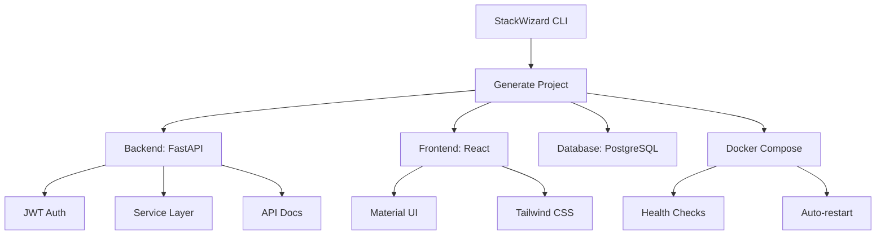

# Welcome to StackWizard Wiki! 🧙‍♂️

StackWizard is a powerful CLI tool that generates complete, production-ready full-stack applications with a single command.

## 📚 Documentation

### Getting Started
- [Installation Guide](Installation) - How to install StackWizard
- [Quick Start](Quick-Start) - Generate your first project
- [Project Structure](Project-Structure) - Understanding generated projects

### Features
- [Backend Architecture](Backend-Architecture) - FastAPI, SQLAlchemy, Service Layer
- [Frontend Options](Frontend-Options) - Material UI vs Tailwind CSS
- [Authentication System](Authentication) - JWT, refresh tokens, security
- [Docker Setup](Docker-Setup) - Container orchestration

### Testing & Quality
- [Cypress Testing](Cypress-Testing) - Visual E2E testing
- [Validation System](Validation-System) - Pre-push validation
- [Test Orchestration](Test-Orchestration) - Makefile and orchestrator
- [CI/CD Integration](CI-CD) - GitHub Actions workflows

### Development
- [Contributing](Contributing) - How to contribute
- [Development Setup](Development-Setup) - Setting up dev environment
- [Release Process](Release-Process) - Version management
- [Troubleshooting](Troubleshooting) - Common issues and solutions

## 🚀 Quick Links

- [NPM Package](https://www.npmjs.com/package/@rafeekpro/stackwizard)
- [GitHub Repository](https://github.com/rafeekpro/stackwizard)
- [Issue Tracker](https://github.com/rafeekpro/stackwizard/issues)
- [Changelog](https://github.com/rafeekpro/stackwizard/blob/main/CHANGELOG.md)

## 📊 Current Version

**Latest Stable**: v1.3.0

### What's New in v1.3.0
- 🎭 Cypress visual testing
- 🛡️ Pre-push validation system
- 📊 Test orchestration with Makefile
- 🚀 Enhanced developer experience

## 💡 Features Overview

## 🛠️ Technology Stack

| Component | Technology | Purpose |
|-----------|------------|---------|
| Backend | FastAPI | High-performance API |
| Frontend | React | Component-based UI |
| Database | PostgreSQL | Relational data storage |
| ORM | SQLAlchemy | Database abstraction |
| Migrations | Alembic | Schema versioning |
| Container | Docker | Environment consistency |
| Testing | Cypress | E2E testing |
| Validation | Custom | Pre-push checks |

## 📈 Project Stats

- **Downloads**: 1000+ (NPM)
- **Stars**: 50+ (GitHub)
- **Contributors**: 5+
- **Test Coverage**: 95%+

---

**Created with ❤️ by [Rafał Łagowski](https://github.com/rafeekpro)**