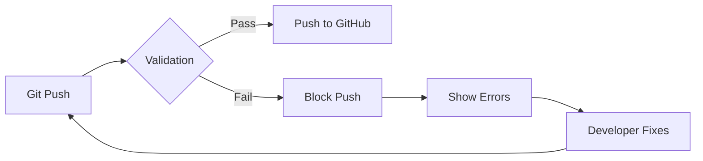

# Pre-Push Validation System 🛡️

## Overview

The validation system ensures that all code works perfectly in Docker containers before it reaches GitHub or npm. This prevents the "works on my machine" problem and catches dependency issues early.

## Problem It Solves

Common issues that slip through:
- Missing npm dependencies in Docker containers
- `Module not found: @mui/material` errors
- Package-lock.json not included in npm package
- Docker build failures
- Runtime errors only discovered by users

## How It Works



## Installation

### Install Git Hooks (One Time)

```bash
npm run install-hooks
```

This configures git to run validation automatically before every push.

## Validation Commands

### Quick Validation (30 seconds)

```bash
npm run validate:quick
```

Checks:
- NPM package contents
- Critical files inclusion
- Basic configuration

### Full Validation (5 minutes) - RECOMMENDED

```bash
npm run validate:full
```

Performs:
1. NPM package validation
2. Generates test projects (MUI & Tailwind)
3. Builds Docker images
4. Runs containers
5. Checks for runtime errors
6. Verifies compilation success

## What Gets Validated

### 1. NPM Package Integrity
- ✅ package-lock.json files included
- ✅ Dockerfile files present
- ✅ All template files included
- ✅ No missing critical files

### 2. Docker Build Validation
- ✅ Frontend builds without errors
- ✅ Backend builds successfully
- ✅ All dependencies resolve
- ✅ No missing packages

### 3. Docker Runtime Validation
- ✅ Containers start successfully
- ✅ No "Module not found" errors
- ✅ Frontend compiles successfully
- ✅ No runtime exceptions

## Validation Workflow

### Automatic (Recommended)

```bash
# After installing hooks
git add .
git commit -m "feat: new feature"
git push  # Validation runs automatically
```

### Manual

```bash
# Before pushing
npm run validate:full

# If validation passes
git push

# If validation fails
# Fix the errors shown
# Run validation again
```

## Understanding Validation Output

### Success Output

```
🔍 Pre-Push Validator

✅ NPM package validation passed
✅ MUI project generated!
✅ Docker build successful for frontend
✅ Docker build successful for backend
✅ Docker runtime validation passed for frontend

📊 Validation Summary
════════════════════════════════════════════════
✅ All validations passed! Safe to push to GitHub.
```

### Failure Output

```
❌ Validation failed! DO NOT push to GitHub.

Errors found:
  • Docker build error: Module not found @mui/material
  • Missing critical file: package-lock.json
  • Runtime error: Can't resolve '@heroicons/react'

Fix the errors above and run validation again.
```

## Fixing Common Validation Errors

### Missing Dependencies

```bash
# In template directory
cd templates/frontend-mui
npm install
# This regenerates package-lock.json
```

### Docker Build Failures

```bash
# Test locally
cd templates/frontend-mui
docker build -t test .
docker run -p 3000:3000 test
# Check logs for errors
```

### NPM Package Issues

```bash
# Check what's included
npm pack --dry-run

# Update .npmignore if needed
```

## Validation Rules

### ALWAYS Run Full Validation When:
- Changing Dockerfile
- Updating package.json
- Modifying templates
- Before releasing new version
- After fixing Docker issues

### Quick Validation Is OK For:
- Documentation changes
- Minor code updates
- Non-template changes

## Emergency Bypass

⚠️ **USE WITH EXTREME CAUTION**

```bash
# Skip validation (NOT RECOMMENDED)
git push --no-verify

# Disable hooks temporarily
git config --unset core.hooksPath

# Re-enable hooks
npm run install-hooks
```

## Integration with CI/CD

The validation system works alongside GitHub Actions:

| Validation Type | When | Duration | Purpose |
|-----------------|------|----------|---------|
| Pre-push (local) | Before push | 5 min | Catch errors early |
| GitHub Actions | After push | 10 min | Verify in clean environment |
| NPM prepublish | Before publish | 2 min | Final package check |

## Makefile Integration

```bash
# Using Makefile commands
make pre-commit      # Quick checks
make test-all        # Full validation
make docker-build-test  # Docker only
```

## Custom Validation

Add custom validation in `pre-push-validator.js`:

```javascript
async validateCustom() {
  // Your custom validation logic
  if (someCondition) {
    this.errors.push('Custom validation failed');
    return false;
  }
  return true;
}
```

## Troubleshooting

### Validation Takes Too Long

```bash
# Run quick validation for minor changes
npm run validate:quick

# Or test specific template
docker build -t test templates/frontend-mui
```

### False Positives

```bash
# Clean Docker cache
docker system prune -a

# Reinstall dependencies
rm -rf node_modules package-lock.json
npm install
```

### Validation Passes Locally but Fails in CI

```bash
# Test in clean environment
docker run -it node:18 bash
git clone <your-repo>
cd <your-repo>
npm install
npm run validate:full
```

---

[Back to Wiki Home](Home)